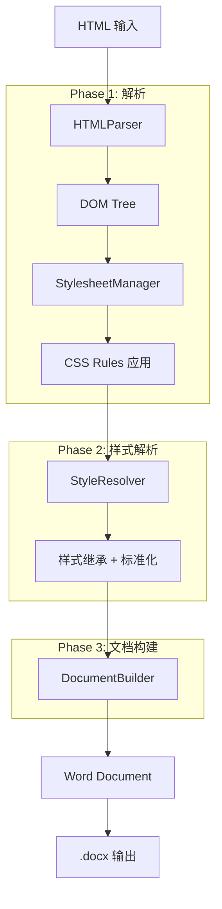
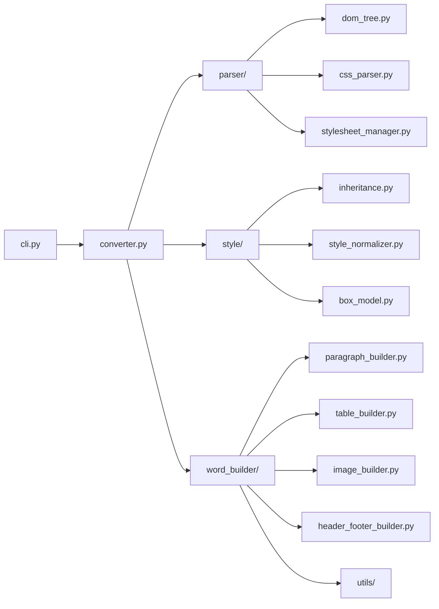

# HTML2Word 代码索引

> 生成时间: 2025-12-03
> 版本: 0.1.0

## 项目概述

**HTML2Word** 是一个功能强大的 HTML 转 Word (.docx) 转换器，支持 CSS 样式保留。该项目能够将 HTML 文档（包括复杂的 CSS 样式、表格、图片等）转换为格式良好的 Microsoft Word 文档。

## 技术栈

| 类别 | 技术/库 |
|------|---------|
| **语言** | Python >= 3.8 |
| **HTML 解析** | BeautifulSoup4, lxml |
| **CSS 解析** | tinycss2 |
| **Word 生成** | python-docx |
| **图像处理** | Pillow |
| **网络请求** | requests |
| **配置管理** | PyYAML |
| **构建工具** | setuptools |

## 入口点

| 入口 | 文件 | 说明 |
|------|------|------|
| **CLI** | `src/html2word/cli.py` | 命令行接口，命令: `html2word` |
| **API** | `src/html2word/__init__.py` | Python API, 导出 `HTML2WordConverter` |
| **主转换器** | `src/html2word/converter.py` | 核心转换协调类 |

## 目录结构

```
html2word/
├── config/                          # 配置文件
│   ├── default_styles.yaml         # HTML 元素默认样式
│   └── font_mapping.yaml           # 字体映射配置
├── src/html2word/                  # 源代码主目录
│   ├── __init__.py                 # 包入口，导出 HTML2WordConverter
│   ├── cli.py                      # 命令行接口
│   ├── converter.py                # 主转换器（转换流程协调）
│   ├── config/                     # 运行时配置
│   │   ├── __init__.py
│   │   └── header_footer_config.py # 页眉页脚配置
│   ├── elements/                   # HTML 元素转换器
│   │   ├── __init__.py
│   │   ├── base.py                 # 基础元素转换器
│   │   ├── image_converter.py      # 图片元素处理
│   │   ├── link_converter.py       # 链接元素处理
│   │   ├── list_converter.py       # 列表元素处理
│   │   ├── table_converter.py      # 表格元素处理
│   │   └── text_converter.py       # 文本元素处理
│   ├── layout/                     # 布局计算模块
│   │   ├── __init__.py
│   │   ├── block_layout.py         # 块级布局
│   │   ├── flow_layout.py          # 流式布局
│   │   ├── inline_layout.py        # 行内布局
│   │   └── position_calculator.py  # 位置计算器
│   ├── parser/                     # HTML/CSS 解析模块
│   │   ├── __init__.py
│   │   ├── css_parser.py           # CSS 解析器
│   │   ├── css_selector.py         # CSS 选择器匹配
│   │   ├── dom_tree.py             # DOM 树数据结构
│   │   ├── html_parser.py          # HTML 解析器
│   │   ├── performance_monitor.py  # 性能监控
│   │   ├── stylesheet_manager.py   # 样式表管理器
│   │   └── stylesheet_manager_optimized.py  # 优化版样式表管理器
│   ├── style/                      # 样式处理模块
│   │   ├── __init__.py
│   │   ├── box_model.py            # 盒模型计算
│   │   ├── inheritance.py          # 样式继承
│   │   ├── style_normalizer.py     # 样式标准化
│   │   └── style_resolver.py       # 样式解析器
│   ├── utils/                      # 工具函数
│   │   ├── __init__.py
│   │   ├── browser_svg_converter.py # 浏览器 SVG 转换
│   │   ├── colors.py               # 颜色处理
│   │   ├── fonts.py                # 字体处理
│   │   ├── font_utils.py           # 字体工具函数
│   │   ├── image_utils.py          # 图片工具函数
│   │   └── units.py                # 单位转换
│   └── word_builder/               # Word 文档构建模块
│       ├── __init__.py
│       ├── document_builder.py     # 文档构建器（主协调）
│       ├── header_footer_builder.py # 页眉页脚构建
│       ├── image_builder.py        # 图片构建
│       ├── paragraph_builder.py    # 段落构建
│       ├── style_mapper.py         # 样式映射器
│       └── table_builder.py        # 表格构建
├── tests/                          # 测试目录
│   └── __init__.py
├── pyproject.toml                  # 项目配置
├── requirements.txt                # 依赖列表
└── setup.py                        # 安装脚本
```

## 核心模块架构

### 转换流程 (Pipeline)



### 模块依赖关系



## 核心类说明

### 1. HTML2WordConverter (`converter.py`)

主转换器类，协调整个转换流程。

**关键方法:**
- `convert(html_input, output_path, input_type)` - 主转换入口
- `convert_file(html_file, output_file)` - 文件转换
- `convert_string(html_string, output_file)` - 字符串转换

**转换四阶段:**
1. **Phase 1**: HTML 解析 (HTMLParser)
2. **Phase 2**: 样式解析 (StyleResolver)
3. **Phase 3**: Word 文档构建 (DocumentBuilder)
4. **Phase 4**: 保存文档

### 2. DOMNode & DOMTree (`parser/dom_tree.py`)

DOM 树数据结构。

**DOMNode 属性:**
- `node_type` - 节点类型 (ELEMENT/TEXT/COMMENT)
- `tag` - HTML 标签名
- `attributes` - HTML 属性
- `inline_styles` - 内联样式
- `computed_styles` - 计算后的样式
- `layout_info` - 布局信息

### 3. StyleResolver (`style/style_resolver.py`)

样式解析引擎，处理样式继承、标准化和计算。

**处理流程:**
1. 样式继承 (StyleInheritance)
2. 样式标准化 (StyleNormalizer)
3. 盒模型计算 (BoxModel)

### 4. DocumentBuilder (`word_builder/document_builder.py`)

Word 文档构建器，将 DOM 树转换为 Word 文档。

**子构建器:**
- `ParagraphBuilder` - 段落/标题构建
- `TableBuilder` - 表格构建
- `ImageBuilder` - 图片构建
- `HeaderFooterBuilder` - 页眉页脚构建

## 特性支持

| 特性 | 状态 | 说明 |
|------|------|------|
| 基本 HTML 元素 | ✅ | p, h1-h6, div, span, etc. |
| 表格 | ✅ | table, tr, td, th, 合并单元格 |
| 列表 | ✅ | ul, ol, li |
| 图片 | ✅ | 本地/网络图片，SVG 转换 |
| 链接 | ✅ | 超链接保留 |
| CSS 样式 | ✅ | 内联样式、style 标签 |
| 样式继承 | ✅ | CSS 样式继承机制 |
| 字体 | ✅ | 字体映射 |
| 颜色 | ✅ | 文本/背景颜色 |
| 边距/间距 | ✅ | margin, padding |
| 边框 | ✅ | 边框样式 |
| 页眉页脚 | ✅ | 可配置 |
| Element UI | ✅ | el-table 等组件支持 |
| ECharts | ✅ | SVG 图表转换 |

## 使用示例

### CLI 使用

```bash
# 基本转换
html2word input.html -o output.docx

# 带调试日志
html2word input.html -o output.docx --log-level DEBUG

# 指定资源基础路径
html2word input.html -o output.docx --base-path /path/to/resources
```

### Python API 使用

```python
from html2word import HTML2WordConverter

# 创建转换器
converter = HTML2WordConverter()

# 文件转换
converter.convert_file("input.html", "output.docx")

# 字符串转换
html_content = "<html><body><h1>Hello</h1></body></html>"
converter.convert_string(html_content, "output.docx")
```

## 最近提交记录

| Commit | 描述 |
|--------|------|
| f3b31d0 | fix: 修复em单位的图标尺寸解析问题 |
| e45a751 | fix: 修复段落段前间距不一致问题 |
| 6df3dee | fix: 修复SVG图标转换问题 |
| a32f297 | fix: 修复图标样式反转问题，改用描边式样式 |
| de8f887 | fix: 修复表头默认对齐方式，改为左对齐 |

---

*此文档由 Claude Code 自动生成*
