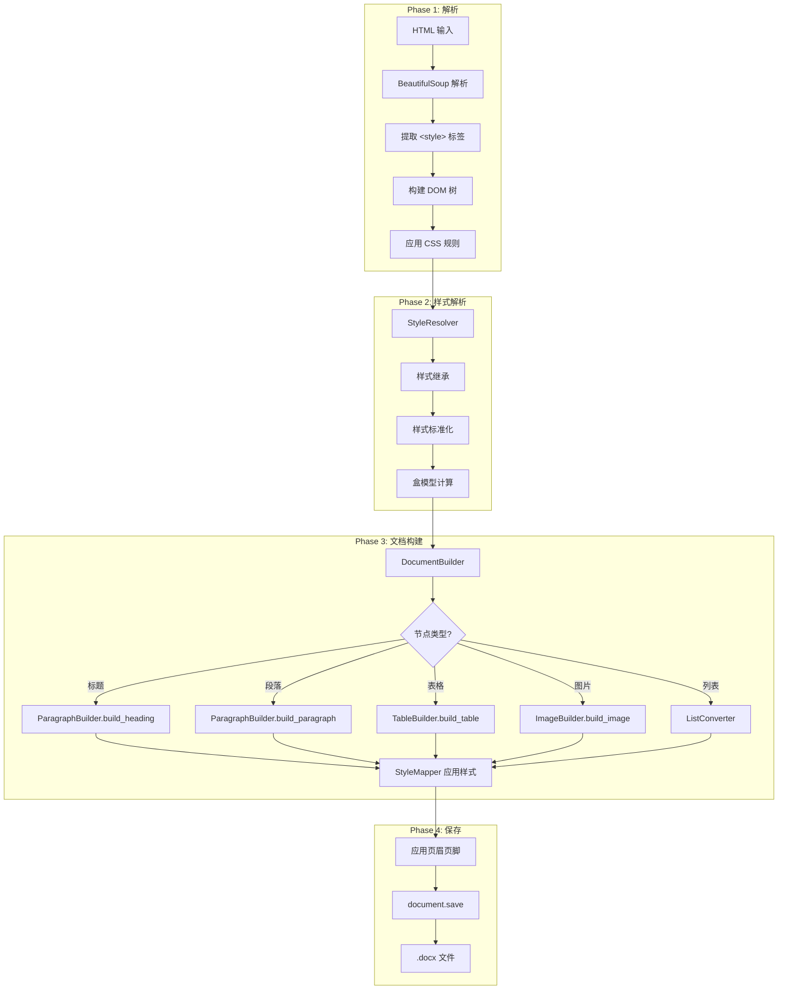
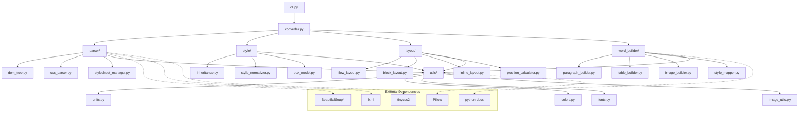

# HTML2Word 整体架构设计

> 本文档详细介绍 HTML2Word 的系统架构、模块设计和数据流。

## 系统架构概览

HTML2Word 采用**分层架构**设计，将复杂的 HTML 到 Word 转换过程分解为多个独立的模块，每个模块负责特定的功能。

```
┌─────────────────────────────────────────────────────────────────┐
│                        Application Layer                         │
│  ┌─────────────┐  ┌─────────────────────────────────────────┐   │
│  │    CLI      │  │              Python API                  │   │
│  │  (cli.py)   │  │         (HTML2WordConverter)             │   │
│  └─────────────┘  └─────────────────────────────────────────┘   │
└─────────────────────────────────────────────────────────────────┘
                                  │
                                  ▼
┌─────────────────────────────────────────────────────────────────┐
│                      Orchestration Layer                         │
│  ┌─────────────────────────────────────────────────────────────┐│
│  │                    HTML2WordConverter                        ││
│  │                     (converter.py)                           ││
│  │    Phase 1 → Phase 2 → Phase 3 → Phase 4                    ││
│  └─────────────────────────────────────────────────────────────┘│
└─────────────────────────────────────────────────────────────────┘
                                  │
        ┌───────────────┬─────────┼─────────┬───────────────┐
        ▼               ▼         ▼         ▼               ▼
┌─────────────┐  ┌─────────────┐  ┌─────────────┐  ┌─────────────┐
│Parser Layer │  │ Style Layer │  │Layout Layer │  │Builder Layer│
│             │  │             │  │             │  │             │
│┌───────────┐│  │┌───────────┐│  │┌───────────┐│  │┌───────────┐│
││HTMLParser ││  ││StyleResol.││  ││FlowLayout ││  ││ Document  ││
│└───────────┘│  │└───────────┘│  │└───────────┘│  ││  Builder  ││
│┌───────────┐│  │┌───────────┐│  │┌───────────┐│  │└───────────┘│
││CSSParser  ││  ││StyleInher.││  ││BlockLayout││  │┌───────────┐│
│└───────────┘│  │└───────────┘│  │└───────────┘│  ││Paragraph  ││
│┌───────────┐│  │┌───────────┐│  │┌───────────┐│  ││  Builder  ││
││DOMTree    ││  ││BoxModel   ││  ││InlineLayout│  │└───────────┘│
│└───────────┘│  │└───────────┘│  │└───────────┘│  │┌───────────┐│
│┌───────────┐│  │┌───────────┐│  │┌───────────┐│  ││TableBuilder│
││Stylesheet ││  ││Normalizer ││  ││PositionCalc│  │└───────────┘│
││ Manager   ││  │└───────────┘│  │└───────────┘│  │┌───────────┐│
│└───────────┘│  │             │  │             │  ││ImageBuilder│
└─────────────┘  └─────────────┘  └─────────────┘  │└───────────┘│
        │               │               │          │┌───────────┐│
        └───────────────┴───────────────┘          ││StyleMapper││
                        │                          │└───────────┘│
                        ▼                          └─────────────┘
               ┌───────────────┐                          │
               │  Utils Layer  │◀─────────────────────────┘
               │               │
               │ ┌───────────┐ │
               │ │UnitConvert│ │
               │ └───────────┘ │
               │ ┌───────────┐ │
               │ │ColorConvert│ │
               │ └───────────┘ │
               │ ┌───────────┐ │
               │ │FontMapper │ │
               │ └───────────┘ │
               │ ┌───────────┐ │
               │ │ImageProc. │ │
               │ └───────────┘ │
               └───────────────┘
```

## 核心模块

### 1. Parser 模块 (`parser/`)

负责 HTML 和 CSS 的解析，构建带有样式信息的 DOM 树。

| 组件 | 文件 | 职责 |
|------|------|------|
| **HTMLParser** | `html_parser.py` | 使用 BeautifulSoup 解析 HTML，构建 DOM 树 |
| **CSSParser** | `css_parser.py` | 使用 tinycss2 解析 CSS 规则 |
| **DOMNode/DOMTree** | `dom_tree.py` | DOM 节点和树的数据结构 |
| **StylesheetManager** | `stylesheet_manager.py` | 管理和应用 CSS 样式表规则 |
| **CSSSelector** | `css_selector.py` | CSS 选择器匹配引擎 |
| **PerformanceMonitor** | `performance_monitor.py` | 解析性能监控与统计 |

```python
# 导出接口
from html2word.parser import HTMLParser, CSSParser, DOMNode, DOMTree
```

### 2. Style 模块 (`style/`)

负责 CSS 样式的计算、继承和标准化。

| 组件 | 文件 | 职责 |
|------|------|------|
| **StyleResolver** | `style_resolver.py` | 样式解析主引擎，协调整个样式计算流程 |
| **StyleInheritance** | `inheritance.py` | 处理 CSS 属性继承 |
| **BoxModel** | `box_model.py` | 计算盒模型 (margin, padding, border) |
| **StyleNormalizer** | `style_normalizer.py` | 标准化 CSS 属性值 |

```python
# 导出接口
from html2word.style import StyleResolver, StyleInheritance, BoxModel, StyleNormalizer
```

### 3. Word Builder 模块 (`word_builder/`)

负责生成 Word 文档，将 DOM 节点转换为 Word 元素。

| 组件 | 文件 | 职责 |
|------|------|------|
| **DocumentBuilder** | `document_builder.py` | 主构建器，协调整个文档生成过程 |
| **ParagraphBuilder** | `paragraph_builder.py` | 构建段落、标题、文本运行 |
| **TableBuilder** | `table_builder.py` | 构建表格，处理单元格合并 |
| **ImageBuilder** | `image_builder.py` | 处理图片，包括 SVG 转换 |
| **StyleMapper** | `style_mapper.py` | 将 CSS 样式映射到 Word 样式 |
| **HeaderFooterBuilder** | `header_footer_builder.py` | 构建页眉页脚 |

```python
# 导出接口
from html2word.word_builder import (
    DocumentBuilder, ParagraphBuilder, TableBuilder,
    ImageBuilder, StyleMapper
)
```

### 4. Elements 模块 (`elements/`)

提供各类 HTML 元素的专用转换器。

| 组件 | 文件 | 职责 |
|------|------|------|
| **BaseConverter** | `base.py` | 转换器基类 |
| **TextConverter** | `text_converter.py` | 文本元素转换 |
| **ListConverter** | `list_converter.py` | 列表 (ul/ol) 转换 |
| **TableConverter** | `table_converter.py` | 表格元素转换 |
| **ImageConverter** | `image_converter.py` | 图片元素转换 |
| **LinkConverter** | `link_converter.py` | 链接元素转换 |

```python
# 导出接口
from html2word.elements import (
    BaseConverter, TextConverter, ListConverter,
    TableConverter, ImageConverter, LinkConverter
)
```

### 5. Layout 模块 (`layout/`)

处理 DOM 元素的布局计算。

| 组件 | 文件 | 职责 |
|------|------|------|
| **FlowLayout** | `flow_layout.py` | 流式布局处理 |
| **BlockLayout** | `block_layout.py` | 块级布局 |
| **InlineLayout** | `inline_layout.py` | 行内布局 |
| **PositionCalculator** | `position_calculator.py` | 位置计算 |

```python
# 导出接口
from html2word.layout import FlowLayout, BlockLayout, InlineLayout, PositionCalculator
```

### 6. Utils 模块 (`utils/`)

提供各种工具函数。

| 组件 | 文件 | 职责 |
|------|------|------|
| **UnitConverter** | `units.py` | CSS 单位转换 (px → pt, em → pt 等) |
| **ColorConverter** | `colors.py` | 颜色格式转换 (rgb, hex, named) |
| **FontMapper** | `fonts.py` | 字体名称映射 |
| **FontUtils** | `font_utils.py` | 字体辅助工具函数 |
| **ImageProcessor** | `image_utils.py` | 图片处理、格式转换 |
| **BrowserSVGConverter** | `browser_svg_converter.py` | SVG 转 PNG (浏览器渲染) |
| **BrowserHTMLConverter** | `browser_html_converter.py` | HTML 片段浏览器渲染 |

```python
# 导出接口
from html2word.utils import UnitConverter, ColorConverter, FontMapper, ImageProcessor
```

### 7. Config 模块 (`config/`)

配置管理。

| 组件 | 文件 | 职责 |
|------|------|------|
| **HeaderFooterConfig** | `header_footer_config.py` | 页眉页脚配置 |

## 转换流程详解

### 四阶段转换管道



### 阶段详解

#### Phase 1: HTML 解析

```python
# converter.py
if input_type == "file":
    tree = self.html_parser.parse_file(html_input)
else:
    tree = self.html_parser.parse(html_input)
```

**处理步骤**:
1. BeautifulSoup 解析 HTML 文档
2. 提取并解析所有 `<style>` 标签中的 CSS
3. 构建 `DOMTree` 数据结构
4. 通过 `StylesheetManager` 将 CSS 规则应用到对应节点

#### Phase 2: 样式解析

```python
# converter.py
self.style_resolver.resolve_styles(tree)
```

**处理步骤**:
1. **样式继承**: 父节点的可继承属性传递给子节点
2. **样式标准化**: 统一单位、颜色格式等
3. **表格边框修复**: 处理特殊的边框继承问题
4. **颜色特异性修复**: 确保类选择器颜色优先级
5. **盒模型计算**: 计算 margin, padding, border

#### Phase 3: 文档构建

```python
# converter.py
document = self.document_builder.build(tree)
```

**处理步骤**:
1. 获取 `<body>` 内容作为处理起点
2. 预处理 SVG 节点 (性能优化)
3. 预索引 Element UI 表格配对
4. 递归遍历 DOM 树，根据节点类型调用对应 Builder
5. 通过 `StyleMapper` 将 CSS 样式映射为 Word 样式

#### Phase 4: 保存

```python
# converter.py
document.save(output_path)
```

**处理步骤**:
1. 应用页眉页脚 (如果启用)
2. 调整表格单元格对齐
3. 保存为 .docx 文件

## 数据结构

### DOMNode

```python
class DOMNode:
    """DOM 树节点"""

    # 基本属性
    node_type: NodeType      # ELEMENT, TEXT, COMMENT
    tag: str                 # HTML 标签名 (小写)
    text: str               # 文本内容 (文本节点)
    attributes: Dict[str, str]  # HTML 属性
    parent: DOMNode         # 父节点
    children: List[DOMNode] # 子节点

    # 样式属性
    inline_styles: Dict[str, str]   # 从 style 属性解析
    computed_styles: Dict[str, Any] # 最终计算样式
    layout_info: Dict[str, Any]     # 布局信息 (含盒模型)
```

### DOMTree

```python
class DOMTree:
    """DOM 树"""

    root: DOMNode           # 根节点

    def traverse(callback, node=None): ...  # 深度优先遍历
    def find_by_tag(tag): ...               # 按标签查找
    def find_by_attribute(name, value): ... # 按属性查找
    def get_stats(): ...                    # 获取统计信息
```

## 模块依赖关系



## 性能优化

HTML2Word 针对大型文档实现了多项并行处理优化，显著提升转换性能。

### 并行处理架构

```
┌─────────────────────────────────────────────────────────────────┐
│                      并行处理层                                  │
├─────────────────────────────────────────────────────────────────┤
│                                                                 │
│  ┌─────────────────────┐      ┌─────────────────────┐          │
│  │  CSS 样式应用        │      │  SVG 批量转换        │          │
│  │  (多进程)            │      │  (多线程)            │          │
│  │                     │      │                     │          │
│  │  ProcessPoolExecutor│      │  ThreadPoolExecutor │          │
│  │  默认 4 workers     │      │  默认 4 workers     │          │
│  └─────────────────────┘      └─────────────────────┘          │
│                                                                 │
│  环境变量配置:                                                   │
│  - HTML2WORD_PARALLEL=true/false  (启用/禁用并行)               │
│  - HTML2WORD_WORKERS=4            (worker 数量)                 │
│  - HTML2WORD_MONITOR=true/false   (性能监控)                    │
│                                                                 │
└─────────────────────────────────────────────────────────────────┘
```

### 1. CSS 样式并行应用 (多进程)

使用 `ProcessPoolExecutor` 将 DOM 节点分块并行处理，大幅减少样式计算时间。

```python
# stylesheet_manager_optimized.py
class StylesheetManagerOptimized:
    def __init__(self):
        self.enable_parallel = _get_default_parallel()  # 默认启用
        self.num_workers = _get_default_workers()       # 默认 4

    def apply_styles_to_tree_parallel(self, node: DOMNode):
        """使用多进程并行应用 CSS 规则"""
        # 1. 收集所有节点
        all_nodes = self._collect_nodes_with_paths(node)

        # 2. 分块处理
        chunks = self._split_nodes_with_paths(all_nodes, self.num_workers)

        # 3. 多进程并行处理
        with ProcessPoolExecutor(max_workers=self.num_workers) as executor:
            futures = [executor.submit(process_chunk, chunk) for chunk in chunks]
            # 合并结果...
```

**优化效果**: 2000+ CSS 规则的大型文档，处理时间减少 60-70%。

### 2. CSS 规则索引

`RuleIndex` 类按 tag/class/id 建立索引，快速筛选候选规则。

```python
# stylesheet_manager_optimized.py
class RuleIndex:
    """CSS 规则索引，避免遍历所有规则"""

    def __init__(self):
        self.tag_index: Dict[str, List[Rule]] = {}    # 按标签索引
        self.class_index: Dict[str, List[Rule]] = {}  # 按类名索引
        self.id_index: Dict[str, List[Rule]] = {}     # 按 ID 索引

    def get_candidate_rules(self, node: DOMNode) -> List[Rule]:
        """获取可能匹配的规则 (从 2000+ 减少到 ~200)"""
```

**优化效果**: 每个节点的规则匹配从 O(n) 降到 O(1) 查找 + O(m) 匹配 (m << n)。

### 3. SVG 批量并行转换 (多线程)

使用 `ThreadPoolExecutor` 并行调用 Chrome headless 渲染 SVG。

```python
# browser_svg_converter.py
class BrowserSVGConverter:
    def __init__(self):
        self._svg_cache: Dict[str, bytes] = {}  # SVG 转换缓存

    def convert_batch(self, svg_list: List[Tuple], max_workers: int = 4):
        """批量并行转换 SVG 为 PNG"""
        with ThreadPoolExecutor(max_workers=max_workers) as executor:
            futures = {executor.submit(self._convert_single, svg): svg
                      for svg in to_convert}
            for future in as_completed(futures, timeout=120):
                svg_hash, png_data = future.result(timeout=15)
                self._svg_cache[svg_hash] = png_data
```

```python
# document_builder.py
def _preprocess_svg_nodes(self, root_node):
    """预处理：收集所有 SVG 并批量转换"""
    svg_nodes = self._collect_svg_nodes(root)
    svg_list = [(node.content, width, height) for node in svg_nodes]

    # 批量并行转换，结果自动缓存
    # Windows上Chrome进程开销较大，并发数降低到2以保证稳定性
    self.svg_converter.convert_batch(svg_list, max_workers=2)
```

### 4. Element UI 表格预索引

预扫描 `el-table` 的 header/body 配对关系，避免重复遍历。

```python
# document_builder.py
def _preindex_el_tables(self, root_node):
    """预索引 el-table 的 header 和 body 配对关系"""
    self._el_table_pairs: Dict[str, Tuple[DOMNode, DOMNode]] = {}
    # 一次遍历建立索引，后续 O(1) 查找
```

### 性能配置示例

```bash
# 禁用并行 (调试用)
export HTML2WORD_PARALLEL=false

# 调整 worker 数量
export HTML2WORD_WORKERS=8

# 启用性能监控日志
export HTML2WORD_MONITOR=true
```

```python
# Python 代码配置
import os
os.environ['HTML2WORD_PARALLEL'] = 'true'
os.environ['HTML2WORD_WORKERS'] = '4'
```

## 扩展点

### 添加新的元素转换器

1. 继承 `BaseConverter`
2. 实现 `convert()` 方法
3. 在 `DocumentBuilder._process_node()` 中注册

```python
# elements/my_converter.py
from html2word.elements.base import BaseConverter

class MyConverter(BaseConverter):
    def convert(self, node: DOMNode, document: Document):
        # 实现转换逻辑
        pass
```

### 添加新的样式处理器

1. 在 `StyleNormalizer` 中添加标准化方法
2. 在 `StyleMapper` 中添加映射规则

## 下一步

- [解析器模块](03_Parser_Module.md) - HTML/CSS 解析原理
- [样式处理模块](04_Style_Module.md) - 样式继承与计算
- [Word 构建模块](05_Word_Builder.md) - Word 文档生成

---

