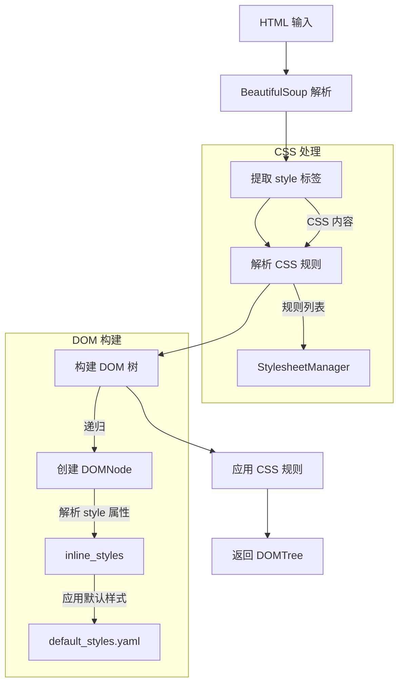
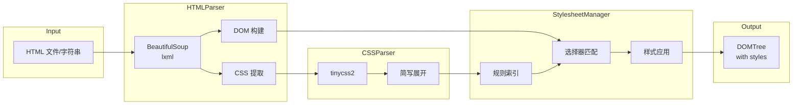

# Parser 模块详解

Parser 模块负责 HTML 解析、CSS 解析和样式应用，是 HTML2Word 转换流程的第一阶段。

## 模块结构

```
src/html2word/parser/
├── __init__.py                    # 模块导出
├── html_parser.py                 # HTML 解析器
├── css_parser.py                  # CSS 解析器
├── css_selector.py                # CSS 选择器匹配引擎
├── dom_tree.py                    # DOM 树数据结构
├── stylesheet_manager.py          # 样式表管理器 (基础版)
├── stylesheet_manager_optimized.py # 样式表管理器 (优化版)
└── performance_monitor.py         # 性能监控
```

## 核心组件

### 1. HTMLParser (`html_parser.py`)

HTML 解析器使用 BeautifulSoup + lxml 解析 HTML 文档，构建带有样式信息的 DOM 树。

#### 类定义

```python
class HTMLParser:
    """Parser for HTML documents."""

    def __init__(self, base_path: Optional[str] = None):
        self.base_path = base_path or os.getcwd()
        self.css_parser = CSSParser()
        self.stylesheet_manager = StylesheetManager()  # 自动选择优化版
        self.default_styles = self._load_default_styles()
```

#### 主要方法

| 方法 | 参数 | 返回值 | 说明 |
|------|------|--------|------|
| `parse(html_content, parser)` | HTML 字符串/字节, 解析器类型 | `DOMTree` | 解析 HTML 内容 |
| `parse_file(file_path, parser)` | 文件路径, 解析器类型 | `DOMTree` | 解析 HTML 文件 |
| `get_body_content(tree)` | DOM 树 | `DOMNode` | 获取 body 节点 |
| `extract_title(tree)` | DOM 树 | `str` | 提取文档标题 |

#### 解析流程



#### 使用示例

```python
from html2word.parser import HTMLParser

# 创建解析器
parser = HTMLParser(base_path="/path/to/resources")

# 解析 HTML 字符串
html_content = """
<!DOCTYPE html>
<html>
<head>
    <style>
        .title { color: blue; font-size: 24px; }
    </style>
</head>
<body>
    <h1 class="title">Hello World</h1>
</body>
</html>
"""
tree = parser.parse(html_content)

# 解析文件
tree = parser.parse_file("document.html")

# 获取 body 内容
body = parser.get_body_content(tree)

# 提取标题
title = parser.extract_title(tree)
```

---

### 2. CSSParser (`css_parser.py`)

CSS 解析器使用 `tinycss2` 库解析 CSS 样式声明和样式表。

#### 类定义

```python
class CSSParser:
    """Parser for inline CSS styles."""

    # 静态文档中跳过的伪类/伪元素
    SKIP_PSEUDO_SELECTORS = frozenset([
        '::before', '::after', ':hover', ':focus', ':active',
        ':visited', ':link', '::placeholder', '::selection', ...
    ])
```

#### 主要方法

| 方法 | 输入 | 输出 | 说明 |
|------|------|------|------|
| `parse_inline_style(style_string)` | `"color: red"` | `{"color": "red"}` | 解析内联样式 |
| `parse_stylesheet(css_string)` | 完整 CSS | `[(selector, styles), ...]` | 解析样式表 |
| `parse_border(border_string)` | `"1px solid red"` | `{width, style, color}` | 解析 border 简写 |
| `parse_font(font_string)` | `"bold 12px Arial"` | `{style, weight, size, family}` | 解析 font 简写 |

#### CSS 简写属性展开

`_expand_shorthands()` 方法自动展开 CSS 简写属性：

```python
# 输入
styles = {"border": "1px solid #ddd"}

# 输出
expanded = {
    "border": "1px solid #ddd",
    "border-width": "1px",
    "border-top-width": "1px",
    "border-right-width": "1px",
    "border-bottom-width": "1px",
    "border-left-width": "1px",
    "border-style": "solid",
    "border-top-style": "solid",
    # ... 同样展开 color
}
```

支持的简写属性：
- `border` → 各边 width/style/color
- `border-top/right/bottom/left` → 对应边的 width/style/color
- `background` → `background-color` (提取渐变中的颜色)
- `gap` → `row-gap` + `column-gap`
- `font` → `font-style/weight/size/family`

#### 渐变颜色提取

```python
# 从 linear-gradient 提取第一个颜色作为 background-color 的近似值
background = "linear-gradient(to right, #ff6b6b, #4ecdc4)"
color = CSSParser._extract_background_color(background)
# 返回: "#ff6b6b"
```

---

### 3. CSSSelector (`css_selector.py`)

CSS 选择器匹配引擎，支持大部分常见 CSS 选择器语法。

#### 支持的选择器类型

| 类型 | 示例 | 说明 |
|------|------|------|
| 通配符 | `*` | 匹配所有元素 |
| 标签 | `div` | 匹配指定标签 |
| 类 | `.container` | 匹配 class |
| ID | `#main` | 匹配 id |
| 组合 | `div.container#main` | 标签+类+ID |
| 属性 | `[type="text"]` | 属性选择器 |
| 后代 | `div p` | 空格分隔 |
| 子元素 | `div > p` | 直接子元素 |
| 相邻兄弟 | `h1 + p` | 紧邻兄弟 |
| 通用兄弟 | `h1 ~ p` | 后续兄弟 |
| 伪类 | `:first-child` | 结构伪类 |

#### 属性选择器操作符

```python
[attr]        # 存在属性
[attr=value]  # 精确匹配
[attr~=value] # 空格分隔的词匹配
[attr|=value] # 前缀匹配 (value 或 value-)
[attr^=value] # 开头匹配
[attr$=value] # 结尾匹配
[attr*=value] # 包含匹配
```

#### 特异性计算

```python
from html2word.parser.css_selector import CSSSelector

# 计算选择器特异性 (a, b, c)
# a: ID 选择器数量
# b: 类/属性/伪类数量
# c: 标签/伪元素数量

CSSSelector.calculate_specificity("div")           # (0, 0, 1)
CSSSelector.calculate_specificity(".foo")          # (0, 1, 0)
CSSSelector.calculate_specificity("#bar")          # (1, 0, 0)
CSSSelector.calculate_specificity("div.foo#bar")   # (1, 1, 1)
CSSSelector.calculate_specificity("ul li.active")  # (0, 1, 2)
```

#### 选择器匹配示例

```python
from html2word.parser.css_selector import CSSSelector
from html2word.parser.dom_tree import DOMNode, NodeType

# 创建测试节点
node = DOMNode(
    node_type=NodeType.ELEMENT,
    tag="div",
    attributes={"class": "container main", "id": "content"}
)

# 匹配测试
CSSSelector.matches("div", node)                    # True
CSSSelector.matches(".container", node)             # True
CSSSelector.matches("#content", node)               # True
CSSSelector.matches("div.container#content", node)  # True
CSSSelector.matches("span", node)                   # False
```

---

### 4. DOMNode 和 DOMTree (`dom_tree.py`)

DOM 树的数据结构定义。

#### DOMNode 属性

```python
class DOMNode:
    # 基础属性
    node_type: NodeType        # ELEMENT, TEXT, COMMENT
    tag: Optional[str]         # 标签名 (小写)
    text: Optional[str]        # 文本内容
    attributes: Dict[str, str] # HTML 属性
    parent: Optional[DOMNode]  # 父节点
    children: List[DOMNode]    # 子节点列表

    # 计算属性
    inline_styles: Dict[str, str]   # 解析自 style 属性
    computed_styles: Dict[str, Any] # 最终计算样式
    layout_info: Dict[str, Any]     # 布局信息
```

#### 节点类型判断

```python
node.is_element      # 是否为元素节点
node.is_text         # 是否为文本节点
node.is_block_level  # 是否为块级元素
node.is_inline       # 是否为行内元素
node.display         # 获取 display 类型
```

#### 块级元素列表

```python
BLOCK_ELEMENTS = {
    'div', 'p', 'h1', 'h2', 'h3', 'h4', 'h5', 'h6',
    'ul', 'ol', 'li', 'table', 'tr', 'td', 'th',
    'blockquote', 'pre', 'hr', 'form', 'fieldset',
    'address', 'article', 'aside', 'footer', 'header',
    'main', 'nav', 'section'
}
```

#### DOMTree 方法

```python
class DOMTree:
    root: DOMNode

    def traverse(callback, node=None)  # 深度优先遍历
    def find_by_tag(tag, node=None)    # 按标签查找
    def find_by_attribute(attr_name, attr_value=None, node=None)  # 按属性查找
    def get_stats()                     # 获取统计信息
```

---

### 5. StylesheetManager (`stylesheet_manager.py`)

基础版样式表管理器，管理 CSS 规则并应用到 DOM 节点。

#### 工作流程

```python
class StylesheetManager:
    rules: List[Tuple[str, Dict[str, str], Tuple[int, int, int]]]
    # 每条规则: (selector, styles, specificity)

    def add_stylesheet(css_content: str)       # 添加 CSS 规则
    def apply_styles_to_node(node: DOMNode)    # 应用到单个节点
    def apply_styles_to_tree(node: DOMNode)    # 应用到整棵树
    def clear()                                 # 清空规则
    def get_rule_count() -> int                 # 获取规则数量
```

#### CSS 层叠规则

```python
def apply_styles_to_node(self, node: DOMNode):
    # 1. 收集所有匹配的规则
    matching_rules = []
    for selector, styles, specificity in self.rules:
        if self.css_selector.matches(selector, node):
            matching_rules.append((styles, specificity))

    # 2. 按特异性排序 (低到高)
    matching_rules.sort(key=lambda x: x[1])

    # 3. 按顺序应用 (后面覆盖前面)
    css_styles = {}
    for styles, specificity in matching_rules:
        css_styles.update(styles)

    # 4. 合并到节点 (内联样式优先级最高)
    for prop, value in css_styles.items():
        if prop not in node.inline_styles:
            node.inline_styles[prop] = value
```

---

### 6. StylesheetManagerOptimized (`stylesheet_manager_optimized.py`)

优化版样式表管理器，支持并行处理和规则索引，显著提升大型文档的处理性能。

#### 配置参数

```bash
# 环境变量配置
HTML2WORD_PARALLEL=true   # 启用并行处理 (默认 true)
HTML2WORD_WORKERS=4       # worker 数量 (默认 4)
HTML2WORD_MONITOR=true    # 启用性能监控 (默认 true)
```

#### RuleIndex - CSS 规则索引

核心优化：通过索引将每个节点需要检查的规则从 ~2000 条减少到 ~200 条。

```python
class RuleIndex:
    """CSS 规则索引系统"""

    # 索引结构
    tag_index: Dict[str, List[Rule]]      # 按标签索引
    class_index: Dict[str, List[Rule]]    # 按类名索引
    id_index: Dict[str, List[Rule]]       # 按 ID 索引
    wildcard_rules: List[Rule]            # 通配符规则
    complex_rules: List[Rule]             # 复杂选择器规则

    def build(rules: List[Rule])          # 构建索引 (一次性)
    def get_candidate_rules(node_data) -> List[Rule]  # 获取候选规则
```

**索引策略：**

1. **简单选择器** (`div.container#main`): 按 tag/class/id 分别索引
2. **复杂选择器** (`div > p.text`): 按最右侧部分索引
3. **通配符选择器** (`*`, `[disabled]`): 每次都检查
4. **跳过的选择器** (`:hover`, `::before`): 静态文档中无效，直接忽略

#### 并行处理架构

```
┌─────────────────────────────────────────────────────────────────┐
│                 StylesheetManagerOptimized                       │
├─────────────────────────────────────────────────────────────────┤
│                                                                 │
│  1. 收集所有节点 + 路径                                          │
│     _collect_all_nodes_with_paths(root)                         │
│                                                                 │
│  2. 分块                                                        │
│     _split_node_paths_into_chunks(nodes, num_workers)           │
│                                                                 │
│  3. 并行处理 (ProcessPoolExecutor)                               │
│     ┌─────────┐ ┌─────────┐ ┌─────────┐ ┌─────────┐            │
│     │Worker 0 │ │Worker 1 │ │Worker 2 │ │Worker 3 │            │
│     │ Chunk 0 │ │ Chunk 1 │ │ Chunk 2 │ │ Chunk 3 │            │
│     └────┬────┘ └────┬────┘ └────┬────┘ └────┬────┘            │
│          │           │           │           │                  │
│          └───────────┴───────────┴───────────┘                  │
│                          │                                       │
│  4. 合并结果                                                     │
│     _merge_results_by_path(results, nodes_with_paths)           │
│                                                                 │
└─────────────────────────────────────────────────────────────────┘
```

#### LightweightNode

并行处理中使用的轻量级节点包装器，支持 CSS 选择器匹配：

```python
class LightweightNode:
    """可序列化的轻量级节点"""

    def __init__(self, path: str, data: Dict, tree: Dict):
        self.path = path
        self.tag = data['tag']
        self.attributes = data.get('attributes', {})
        self.inline_styles = data.get('inline_styles', {})
        self.is_element = True
        self._tree = tree

    @property
    def parent(self):
        # 从 tree 中查找父节点
        ...

    @property
    def children(self):
        # 从 tree 中查找子节点
        ...
```


## 数据流图



---

## 最佳实践

### 1. 选择合适的解析器

```python
# lxml (推荐) - 速度快，容错性好
tree = parser.parse(html, parser="lxml")

# html.parser (备选) - 纯 Python，无需编译
tree = parser.parse(html, parser="html.parser")
```

### 2. 处理大型文档

```python
import os

# 启用并行处理
os.environ['HTML2WORD_PARALLEL'] = 'true'

# 根据 CPU 核心数调整 worker 数量
os.environ['HTML2WORD_WORKERS'] = '8'

# 启用性能监控查看瓶颈
os.environ['HTML2WORD_MONITOR'] = 'true'
```

### 3. 调试 CSS 匹配问题

```python
import logging
logging.getLogger('html2word.parser').setLevel(logging.DEBUG)

# 查看哪些规则被应用
tree = parser.parse(html)
for node in tree.find_by_tag('div'):
    print(f"Node: {node.tag}, class={node.attributes.get('class')}")
    print(f"Inline styles: {node.inline_styles}")
```

---

## 常见问题

### Q: 为什么某些 CSS 规则没有生效？

**A:** 可能原因：
1. 选择器不匹配 - 使用 `CSSSelector.matches()` 测试
2. 特异性问题 - 更高特异性的规则覆盖了
3. 内联样式覆盖 - 内联样式优先级最高
4. 伪类被跳过 - `:hover` 等动态伪类不适用于静态文档

### Q: 并行处理出错怎么办？

**A:** 优化版会自动降级到顺序处理：
```python
# 手动禁用并行
os.environ['HTML2WORD_PARALLEL'] = 'false'
```

### Q: 如何添加默认样式？

**A:** 编辑 `config/default_styles.yaml`:
```yaml
h1:
  font-size: "24pt"
  font-weight: "bold"
  margin-top: "12pt"
  margin-bottom: "6pt"

table:
  border-collapse: "collapse"
```
