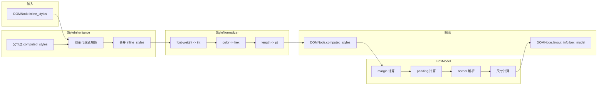

# 04. Style 模块 - 样式处理

> Style 模块负责 CSS 样式的继承、规范化和盒模型计算，是 HTML 到 Word 转换的样式处理核心。

---

## 模块结构

```
src/html2word/style/
├── __init__.py              # 导出接口
├── style_resolver.py        # 样式解析器 (主入口)
├── inheritance.py           # CSS 继承处理
├── style_normalizer.py      # 样式规范化
└── box_model.py             # 盒模型计算
```

## 导入接口

```python
from html2word.style import (
    StyleResolver,       # 样式解析协调器
    StyleInheritance,    # CSS 继承处理
    StyleNormalizer,     # 样式规范化
    BoxModel             # 盒模型计算
)
```

---

## 样式处理流程

```mermaid
graph TB
    subgraph "Phase 2: 样式解析"
        A[DOM Tree + inline_styles] --> B[StyleResolver.resolve_styles]

        B --> C[Step 1: 样式继承]
        C --> D[StyleInheritance.apply_inheritance]
        D --> E[computed_styles 初始化]

        E --> F[Step 2: 样式规范化]
        F --> G[StyleNormalizer.normalize_styles]
        G --> H[标准化值格式]

        H --> I[Step 2.5: 表格边框修复]
        I --> J[_fix_table_borders]

        J --> K[Step 2.6: 颜色特异性修复]
        K --> L[_fix_color_specificity]

        L --> M[Step 3: 盒模型计算]
        M --> N[BoxModel 实例化]
        N --> O[layout_info.box_model]
    end

    style B fill:#e1f5fe
    style D fill:#f3e5f5
    style G fill:#fff3e0
    style N fill:#e8f5e9
```



---

## 核心组件详解

### 1. StyleResolver (样式解析器)

**文件**: [style_resolver.py](../src/html2word/style/style_resolver.py)

样式处理的主协调器，负责编排所有样式计算步骤。

```python
class StyleResolver:
    """协调样式继承、规范化和盒模型计算"""

    def __init__(self):
        self.inheritance = StyleInheritance()
        self.normalizer = StyleNormalizer()

    def resolve_styles(self, tree: DOMTree):
        """
        样式解析主入口

        处理步骤:
        1. 获取初始样式 (body 元素)
        2. 应用样式继承
        3. 规范化样式值
        4. 修复表格边框问题
        5. 修复颜色特异性问题
        6. 计算盒模型
        """
        initial_styles = self._get_initial_styles(tree)
        self.inheritance.apply_inheritance(tree.root, initial_styles)
        self._normalize_tree_styles(tree.root)
        self._fix_table_borders(tree.root)
        self._fix_color_specificity(tree.root)
        self._calculate_box_models(tree.root)
```

#### 辅助方法

| 方法 | 功能 |
|------|------|
| `_get_initial_styles(tree)` | 从 body 元素获取根样式 |
| `_normalize_tree_styles(node)` | 递归规范化整棵树 |
| `_fix_table_borders(node)` | 修复表格单元格 3px 边框问题 |
| `_fix_color_specificity(node)` | 修复类名颜色被父容器覆盖问题 |
| `_calculate_box_models(node)` | 递归计算盒模型 |
| `get_computed_style(node, prop)` | 获取节点计算样式 |
| `get_box_model(node)` | 获取节点盒模型 |

#### 使用示例

```python
from html2word.parser import HTMLParser
from html2word.style import StyleResolver

# 解析 HTML
parser = HTMLParser()
tree = parser.parse("<div style='color: red; font-size: 16px;'>Hello</div>")

# 解析样式
resolver = StyleResolver()
resolver.resolve_styles(tree)

# 获取计算样式
div = tree.root.children[0]
color = resolver.get_computed_style(div, 'color')  # '#ff0000'
box = resolver.get_box_model(div)  # BoxModel instance
```

---

### 2. StyleInheritance (样式继承)

**文件**: [inheritance.py](../src/html2word/style/inheritance.py)

实现 CSS 属性的继承规则。

#### 可继承属性

```python
INHERITED_PROPERTIES = {
    # 字体属性
    'font-family', 'font-size', 'font-style', 'font-weight', 'font-variant', 'font',

    # 文本属性
    'color', 'line-height', 'letter-spacing', 'word-spacing',
    'text-align', 'text-indent', 'text-transform',
    'white-space', 'direction',

    # 列表属性
    'list-style-type', 'list-style-position', 'list-style-image', 'list-style',

    # 表格属性
    'border-collapse', 'border-spacing', 'caption-side', 'empty-cells',

    # 其他
    'visibility', 'cursor', 'quotes',
}
```

#### 不可继承属性

```python
NON_INHERITED_PROPERTIES = {
    # 盒模型
    'margin', 'margin-*', 'padding', 'padding-*',
    'border', 'border-*', 'width', 'height', 'max-*', 'min-*',

    # 背景
    'background', 'background-*',

    # 定位
    'position', 'top', 'right', 'bottom', 'left',
    'float', 'clear', 'z-index',

    # 显示
    'display', 'overflow', 'clip',

    # 其他
    'vertical-align', 'text-decoration',
}
```

#### 继承算法

```python
@classmethod
def apply_inheritance(cls, tree_root: DOMNode, initial_styles: Dict = None):
    """
    递归应用样式继承

    算法:
    1. 从 initial_styles 开始 (通常是 body 样式)
    2. 对于每个节点:
       a. 继承父节点的可继承属性
       b. 节点自身的 inline_styles 覆盖继承值
       c. 存储为 computed_styles
       d. 递归处理子节点
    """
    def process_node(node: DOMNode, parent_styles: Dict):
        if node.is_element:
            # 计算继承样式
            computed = cls.compute_inherited_styles(node, parent_styles)

            # 添加非继承的 inline 样式
            for prop, value in node.inline_styles.items():
                computed[prop] = value

            # 存储计算样式
            node.computed_styles = computed

            # 递归处理子节点
            for child in node.children:
                process_node(child, computed)

        elif node.is_text:
            # 文本节点继承所有父样式
            node.computed_styles = parent_styles.copy()

    process_node(tree_root, initial_styles or {})
```

#### 默认样式值

```python
@classmethod
def get_default_inherited_styles(cls) -> Dict[str, str]:
    """获取可继承属性的默认值"""
    return {
        'font-style': 'normal',
        'font-weight': 'normal',
        'font-variant': 'normal',
        'color': '#000000',
        'line-height': '1.2',
        'letter-spacing': 'normal',
        'word-spacing': 'normal',
        'text-align': 'left',
        'text-indent': '0',
        'text-transform': 'none',
        'white-space': 'normal',
        'direction': 'ltr',
        'list-style-type': 'disc',
        'list-style-position': 'outside',
        'border-collapse': 'separate',
        'border-spacing': '2px',
        'visibility': 'visible',
    }
```

> **注意**: `font-family` 和 `font-size` 不包含默认值，应从 HTML/CSS 中获取。

---

### 3. StyleNormalizer (样式规范化)

**文件**: [style_normalizer.py](../src/html2word/style/style_normalizer.py)

将 CSS 值规范化为统一格式，便于后续处理。

#### 规范化映射

| 属性类型 | 输入示例 | 输出示例 |
|----------|----------|----------|
| font-weight | `"bold"`, `"700"` | `700` (int) |
| font-size | `"16px"`, `"1em"` | `12.0` (pt) |
| color | `"red"`, `"rgb(255,0,0)"` | `"#ff0000"` |
| line-height | `"normal"`, `"1.5"`, `"24px"` | `1.2` / `1.5` / `18.0` |
| text-decoration | `"underline solid red"` | `"underline"` |
| text-align | `"start"`, `"justify"` | `"left"` |

#### font-weight 规范化

```python
FONT_WEIGHT_MAP = {
    'normal': 400,
    'bold': 700,
    'bolder': 900,
    'lighter': 300,
}

@classmethod
def normalize_font_weight(cls, value: str) -> int:
    """
    将 font-weight 转换为数值

    Examples:
        normalize_font_weight('bold')   -> 700
        normalize_font_weight('normal') -> 400
        normalize_font_weight('600')    -> 600
    """
    value_lower = value.lower()
    if value_lower in cls.FONT_WEIGHT_MAP:
        return cls.FONT_WEIGHT_MAP[value_lower]

    try:
        weight = int(value)
        return max(100, min(900, weight))  # Clamp to 100-900
    except ValueError:
        return 400  # Default
```

#### text-align 规范化

```python
@classmethod
def normalize_text_align(cls, value: str, context: str = None) -> str:
    """
    规范化 text-align

    特殊处理:
    - 'start' -> 'left' (LTR 假设)
    - 'end' -> 'right'
    - 'justify' 在表格单元格中 -> 'left' (避免换行问题)
    """
    value_lower = value.lower().strip()

    if value_lower == 'start':
        return 'left'
    elif value_lower == 'end':
        return 'right'
    elif value_lower == 'justify' and context == 'table_cell':
        return 'left'  # 表格单元格不使用 justify

    return value_lower if value_lower in TEXT_ALIGN_VALUES else 'left'
```

#### text-transform 应用

```python
@classmethod
def apply_text_transform(cls, text: str, transform: str) -> str:
    """
    应用 text-transform 到文本

    Examples:
        apply_text_transform('hello', 'uppercase')   -> 'HELLO'
        apply_text_transform('HELLO', 'lowercase')   -> 'hello'
        apply_text_transform('hello world', 'capitalize') -> 'Hello World'
    """
    if transform == 'uppercase':
        return text.upper()
    elif transform == 'lowercase':
        return text.lower()
    elif transform == 'capitalize':
        return text.title()
    return text
```

---

### 4. BoxModel (盒模型)

**文件**: [box_model.py](../src/html2word/style/box_model.py)

计算 CSS 盒模型，包括 margin、padding、border 和尺寸。

#### 数据结构

```python
@dataclass
class BoxEdge:
    """盒模型边距 (top, right, bottom, left)"""
    top: float = 0.0
    right: float = 0.0
    bottom: float = 0.0
    left: float = 0.0

@dataclass
class BorderEdge:
    """单边边框属性"""
    width: float = 0.0
    style: str = 'none'
    color: str = '#000000'

class Border:
    """四边边框"""
    top: BorderEdge
    right: BorderEdge
    bottom: BorderEdge
    left: BorderEdge

    def has_border(self) -> bool:
        """检查是否有可见边框"""
        return any([
            self.top.width > 0 and self.top.style != 'none',
            self.right.width > 0 and self.right.style != 'none',
            self.bottom.width > 0 and self.bottom.style != 'none',
            self.left.width > 0 and self.left.style != 'none'
        ])
```

#### BoxModel 类

```python
class BoxModel:
    """CSS 盒模型计算"""

    def __init__(self, node: DOMNode, context: Dict = None):
        self.node = node
        self.context = context or {}
        self.styles = node.computed_styles

        # 盒模型组件 (单位: pt)
        self.margin = BoxEdge()
        self.padding = BoxEdge()
        self.border = Border()
        self.width: Optional[float] = None
        self.height: Optional[float] = None
        self.box_sizing = 'content-box'

        self._calculate()

    def _calculate(self):
        """计算所有盒模型属性"""
        self._calculate_margin()
        self._calculate_padding()
        self._calculate_border()
        self._calculate_dimensions()
        self._get_box_sizing()
```

#### 盒模型示意图

```
┌─────────────────────────────────────────────────────┐
│                      margin                          │
│  ┌───────────────────────────────────────────────┐  │
│  │                   border                       │  │
│  │  ┌─────────────────────────────────────────┐  │  │
│  │  │                padding                   │  │  │
│  │  │  ┌───────────────────────────────────┐  │  │  │
│  │  │  │                                   │  │  │  │
│  │  │  │            content                │  │  │  │
│  │  │  │         (width × height)          │  │  │  │
│  │  │  │                                   │  │  │  │
│  │  │  └───────────────────────────────────┘  │  │  │
│  │  │                                         │  │  │
│  │  └─────────────────────────────────────────┘  │  │
│  │                                               │  │
│  └───────────────────────────────────────────────┘  │
│                                                      │
└─────────────────────────────────────────────────────┘
```

#### 尺寸计算方法

```python
def get_total_width(self) -> Optional[float]:
    """计算总宽度 (包含 padding 和 border)"""
    if self.width is None:
        return None

    if self.box_sizing == 'border-box':
        return self.width  # 已包含
    else:
        return (self.width +
                self.padding.left + self.padding.right +
                self.border.left.width + self.border.right.width)

def get_content_width(self) -> Optional[float]:
    """计算内容宽度 (不含 padding 和 border)"""
    if self.width is None:
        return None

    if self.box_sizing == 'border-box':
        return (self.width -
                self.padding.left - self.padding.right -
                self.border.left.width - self.border.right.width)
    else:
        return self.width

def get_horizontal_spacing(self) -> float:
    """水平间距总和 (margin + padding + border)"""
    return (self.margin.left + self.margin.right +
            self.padding.left + self.padding.right +
            self.border.left.width + self.border.right.width)

def get_vertical_spacing(self) -> float:
    """垂直间距总和"""
    return (self.margin.top + self.margin.bottom +
            self.padding.top + self.padding.bottom +
            self.border.top.width + self.border.bottom.width)
```

#### 边框简写解析

```python
def _parse_border_shorthand(self):
    """
    解析边框简写属性

    支持格式:
    - border: 1px solid #ddd
    - border-left: 2px dashed red
    """
    for side in ['top', 'right', 'bottom', 'left']:
        shorthand_key = f'border-{side}'
        if shorthand_key in self.styles:
            value = self.styles[shorthand_key]
            parts = str(value).strip().split()

            for part in parts:
                if re.match(r'^\d+(\.\d+)?(px|pt|em)?$', part):
                    # 宽度
                    self.styles[f'border-{side}-width'] = part
                elif part in ['solid', 'dashed', 'dotted', 'double', ...]:
                    # 样式
                    self.styles[f'border-{side}-style'] = part
                else:
                    # 颜色
                    self.styles[f'border-{side}-color'] = part
```

#### 使用示例

```python
from html2word.style import BoxModel

# 假设 node.computed_styles 包含:
# {
#     'width': '200px',
#     'padding': '10px 20px',
#     'margin': '5px',
#     'border': '1px solid #ccc',
#     'box-sizing': 'border-box'
# }

box = BoxModel(node)

print(box.width)           # 150.0 (pt)
print(box.padding.left)    # 15.0 (pt)
print(box.padding.top)     # 7.5 (pt)
print(box.margin.left)     # 3.75 (pt)
print(box.border.left.width)  # 0.75 (pt)
print(box.border.left.style)  # 'solid'
print(box.border.left.color)  # '#ccc'

print(box.get_total_width())    # 150.0 (border-box)
print(box.get_content_width())  # 118.5 (减去 padding 和 border)
```

---

## 特殊处理

### 表格边框修复

某些场景下，父容器的 3px 边框会错误继承到表格单元格：

```python
def _fix_table_borders(self, node: DOMNode):
    """
    修复表格边框继承问题

    问题: .common-left-border 的 3px border-left
          会被应用到 td/th 单元格

    解决: 检测 td/th 中的 3px 边框，重置为 1px
    """
    if node.tag in ['td', 'th']:
        if node.computed_styles.get('border-left-width') in ['3px', '3.0px']:
            node.computed_styles['border-left-width'] = '1px'
```

### 颜色特异性修复

某些类名定义的颜色可能被父容器覆盖：

```python
def _fix_color_specificity(self, node: DOMNode):
    """
    修复颜色类被覆盖问题

    问题: .col-risk {color:#e65050} 被
          .report-template__wrapper {color:#444b55} 覆盖

    解决: 检测特定类名，强制应用对应颜色
    """
    default_colors = {
        'col-risk': '#e65050',      # 红色
        'col-warning': '#f39c12',   # 橙色
        'col-success': '#27ae60',   # 绿色
        'col-error': '#e74c3c',     # 红色
        'col-info': '#3498db'       # 蓝色
    }

    classes = node.attributes.get('class', [])
    for cls in classes:
        if cls in default_colors:
            node.computed_styles['color'] = default_colors[cls]
            break
```

---

## 数据流图



---

## 最佳实践

### 1. 样式解析顺序

```python
# 正确顺序
parser = HTMLParser()
tree = parser.parse(html)           # 1. 解析 HTML + CSS 规则
stylesheet_manager.apply_styles_to_tree(tree.root)  # 2. 应用 CSS 规则
resolver = StyleResolver()
resolver.resolve_styles(tree)       # 3. 继承 + 规范化 + 盒模型
```

### 2. 获取样式值

```python
# 获取计算后的样式
color = node.computed_styles.get('color', '#000000')
font_size = node.computed_styles.get('font-size', '12pt')

# 获取盒模型
box = node.layout_info.get('box_model')
if box:
    margin_top = box.margin.top  # pt
    has_border = box.border.has_border()
```

### 3. 调试样式问题

```python
import logging
logging.getLogger('html2word.style').setLevel(logging.DEBUG)

# 检查继承链
def print_style_chain(node: DOMNode, prop: str):
    current = node
    while current:
        value = current.computed_styles.get(prop)
        print(f"{current.tag}: {prop} = {value}")
        current = current.parent
```

---

## 常见问题

### Q: 为什么某个样式没有生效？

**排查步骤**:
1. 检查 `node.inline_styles` 是否包含该属性
2. 检查 CSS 规则是否被 `StylesheetManager` 应用
3. 检查是否被更高特异性的规则覆盖
4. 检查是否是可继承属性

### Q: 如何处理 `em`/`rem` 单位？

```python
# StyleNormalizer 自动调用 UnitConverter
# context 中需要包含 parent_font_size 和 root_font_size

context = {
    'parent_font_size': 12.0,  # pt
    'root_font_size': 12.0     # pt
}
pt_value = UnitConverter.to_pt('1.5em', context)  # 18.0
```

### Q: 如何扩展颜色类修复列表？

```python
# 在 style_resolver.py 中修改 default_colors
default_colors = {
    'col-risk': '#e65050',
    'col-custom': '#123456',  # 添加自定义类
}
```

---

## 下一步

- [05. Word Builder 模块](./05_Word_Builder.md) - Word 文档构建
- [07. Utils 模块](./07_Utils.md) - 工具函数 (UnitConverter, ColorConverter)
