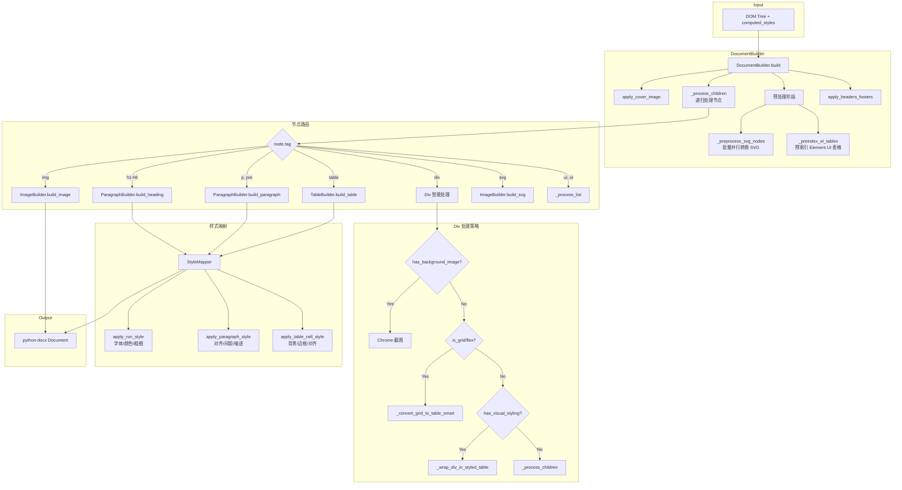
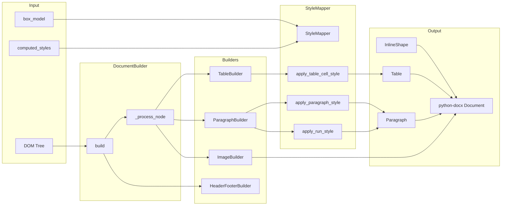

# 05. Word Builder 模块

Word Builder 模块负责将 DOM 树和计算后的样式转换为 Word 文档。这是 HTML2Word 转换链的最后一环，直接与 `python-docx` 库交互。

---

## 模块结构

```
word_builder/
├── __init__.py                # 模块导出
├── document_builder.py        # 文档构建器（主协调器）
├── paragraph_builder.py       # 段落构建器
├── table_builder.py           # 表格构建器
├── image_builder.py           # 图片/SVG 构建器
├── style_mapper.py            # CSS 到 Word 样式映射
└── header_footer_builder.py   # 页眉页脚构建器
```

---

## 导入接口

```python
from html2word.word_builder import (
    DocumentBuilder,      # 主构建器
    ParagraphBuilder,     # 段落构建
    TableBuilder,         # 表格构建
    ImageBuilder,         # 图片构建
    StyleMapper,          # 样式映射
)
```

---

## 构建流程图



---

## 核心类详解

### 1. DocumentBuilder (document_builder.py)

主协调器，负责整个文档构建流程。

#### 初始化

```python
class DocumentBuilder:
    def __init__(self, base_path: Optional[str] = None, enable_header_footer: bool = True):
        self.base_path = base_path
        self.document = Document()  # python-docx Document
        self.paragraph_builder = ParagraphBuilder(self.document, document_builder=self)
        self.table_builder = TableBuilder(self.document)
        self.image_builder = ImageBuilder(self.document, base_path)
        self.header_footer_builder = HeaderFooterBuilder(self.document, base_path)

        # 状态跟踪
        self.in_table_cell = False           # 是否在表格单元格内
        self.processed_nodes = set()         # 已处理节点（避免重复）

        # 性能优化缓存
        self._svg_cache = {}                 # SVG 节点缓存
        self._bg_image_cache = {}            # 背景图片缓存
        self._el_table_pairs = {}            # Element UI 表格配对缓存
```

#### 主构建方法

```python
def build(self, tree: DOMTree) -> Document:
    """
    构建 Word 文档。

    流程：
    1. 添加封面图片（如果启用）
    2. SVG 批量预处理（并行转换）
    3. Element UI 表格预索引
    4. 递归处理 DOM 节点
    5. 应用页眉页脚
    6. 全局表格对齐修正
    """
```

#### 节点路由逻辑

```python
def _process_node(self, node: DOMNode):
    """根据节点类型路由到不同的构建器"""

    # 1. 跳过隐藏元素
    if self._should_skip_hidden_element(node):
        return

    # 2. 处理绝对/固定定位元素
    if position in ('absolute', 'fixed'):
        if node.tag == 'svg':
            pass  # SVG 继续处理
        elif self._has_background_image_in_inline_styles(node):
            pass  # 背景图片继续处理
        elif self._contains_important_content(node):
            self._process_children(node)
            return
        else:
            return  # 跳过

    # 3. 根据标签路由
    tag = node.tag

    if tag in ('h1', 'h2', 'h3', 'h4', 'h5', 'h6'):
        self.paragraph_builder.build_heading(node, level)
    elif tag in ('p', 'blockquote', 'pre'):
        self.paragraph_builder.build_paragraph(node)
    elif tag == 'div':
        # Div 智能处理（见下文）
    elif tag == 'table':
        self.table_builder.build_table(node)
    elif tag == 'img':
        self.image_builder.build_image(node)
    elif tag == 'svg':
        self._process_svg(node)
    # ...
```

#### Div 智能处理策略

```python
def _process_node(self, node: DOMNode):
    # ...
    elif tag == 'div':
        # 优先级 1：Element UI 隐藏列
        if 'hidden-columns' in div_classes:
            return  # 跳过

        # 优先级 2：Element UI 表格包装器
        elif any(cls in div_classes for cls in ['el-table', 'el-table__header-wrapper', ...]):
            self._process_children(node)  # 直接处理子元素

        # 优先级 3：背景图片（需要 Chrome 截图）
        elif self._has_background_image(node):
            self._convert_background_image_element(node)

        # 优先级 4：图标+文字模式
        elif self._is_icon_text_pattern(node):
            self.paragraph_builder.build_paragraph(node)

        # 优先级 5：包含 SVG（ECharts 图表）
        elif self._contains_svg(node):
            self._process_children(node)

        # 优先级 6：Grid/Flex 布局
        elif self._should_convert_to_grid_table(node):
            self._convert_grid_to_table_smart(node)

        # 优先级 7：简单文本 Div
        elif self._should_treat_div_as_paragraph(node):
            self.paragraph_builder.build_paragraph(node)

        # 优先级 8：有视觉样式的 Div（背景/边框）
        elif self._should_wrap_in_styled_table(node):
            self._wrap_div_in_styled_table(node)

        # 优先级 9：普通容器
        else:
            self._process_children(node)
```

---

### 2. ParagraphBuilder (paragraph_builder.py)

构建 Word 段落和标题。

#### 核心方法

```python
class ParagraphBuilder:
    def __init__(self, document, document_builder=None):
        self.document = document
        self.document_builder = document_builder
        self.style_mapper = StyleMapper()
        self.last_margin_bottom = 0.0  # 用于 margin collapse

    def build_paragraph(self, node: DOMNode) -> Optional[object]:
        """
        构建段落，支持 margin collapse。

        特点：
        - 自动将 left/start 对齐转换为 justify
        - 处理 keep_with_next（标题不与后续内容分离）
        - 处理内联元素（span, strong, em 等）
        """
        paragraph = self.document.add_paragraph()

        # 应用段落样式（含 margin collapse）
        self.style_mapper.apply_paragraph_style(
            paragraph,
            styles,
            box_model,
            prev_margin_bottom=self.last_margin_bottom,
            in_table_cell=in_table_cell
        )

        # 处理内容
        self._process_content(node, paragraph)

        # 更新 margin_bottom 用于下一个元素
        self.last_margin_bottom = box_model.margin.bottom if box_model else 0.0

        return paragraph

    def build_heading(self, node: DOMNode, level: int = 1) -> Optional[object]:
        """构建标题（h1-h6）"""
        paragraph = self.build_paragraph(node)

        if paragraph:
            paragraph.style = f'Heading {level}'
            paragraph.paragraph_format.keep_with_next = True  # 防止分页

        return paragraph
```

#### 内联元素处理

```python
def _process_content(self, node: DOMNode, paragraph):
    """处理段落内容（文本和内联元素）"""
    for child in node.children:
        if child.is_text:
            self._add_text_run(child, paragraph)
        elif child.tag == 'img':
            self._add_inline_image(child, paragraph)
        elif child.tag == 'svg':
            self._add_inline_svg(child, paragraph)
        elif child.is_inline:
            self._process_inline_element(child, paragraph)

def _add_text_run(self, text_node: DOMNode, paragraph):
    """添加文本 Run"""
    text = text_node.text or ""

    # 规范化空白
    text = InlineLayout.normalize_whitespace(text)

    # 应用 text-transform
    if text_node.computed_styles.get('text-transform'):
        text = StyleNormalizer.apply_text_transform(text, ...)

    run = paragraph.add_run(text)
    self.style_mapper.apply_run_style(run, text_node.computed_styles)
```

#### 内联 SVG 处理

```python
def _add_inline_svg(self, svg_node: DOMNode, paragraph):
    """
    将内联 SVG 转换为图片插入段落。

    转换策略：
    1. 尝试 cairosvg 转换
    2. 尝试 Chrome headless 转换
    3. 如果是图标且引用缺失的 symbol，创建 fallback 图标
    """
    # 检查是否是缺失 symbol 的图标
    use_element = self._find_use_element(svg_node)
    if use_element and self._is_missing_symbol(use_element, svg_node):
        png_data = self._create_inline_icon_fallback(...)
    else:
        # 正常 SVG 转换
        png_data = self._convert_svg_to_png(svg_content)

    if png_data:
        run = paragraph.add_run()
        run.add_picture(io.BytesIO(png_data), width=..., height=...)
```

---

### 3. TableBuilder (table_builder.py)

构建 Word 表格，支持合并单元格、Element UI 表格等。

#### 核心方法

```python
class TableBuilder:
    def __init__(self, document):
        self.document = document
        self.style_mapper = StyleMapper()
        self.paragraph_builder = ParagraphBuilder(document)

    def build_table(self, table_node: DOMNode) -> Optional[object]:
        """
        构建表格。

        流程：
        1. 提取行节点
        2. 计算列数（排除 gutter 列）
        3. 创建表格
        4. 填充单元格（处理合并）
        5. 应用表格样式
        """
        rows = self._extract_rows(table_node)
        num_cols = self._calculate_columns(rows)

        table = self.document.add_table(rows=len(rows), cols=num_cols)
        self._fill_table(table, rows)
        self._apply_table_style(table, table_node)

        return table
```

#### Element UI Gutter 列检测

```python
def _has_gutter_column(self, rows: List[DOMNode], max_cols: int) -> bool:
    """
    检测 Element UI 的 gutter 列（滚动条占位列）。

    检测策略：
    1. 任何单元格有 class="gutter" -> 确定有 gutter
    2. 某些行比其他行多一列，且最后一列为空 -> 可能是 gutter
    """
    # 优先检查 class="gutter"
    for row in rows:
        for cell in row.children:
            if 'gutter' in cell.attributes.get('class', '').lower():
                return True

    # 检查行单元格数量差异
    row_cell_counts = [sum(1 for c in row.children if c.tag in ('td', 'th')) for row in rows]
    if max(row_cell_counts) == min(row_cell_counts) + 1:
        # 检查多出的单元格是否为空
        ...
```

#### 单元格合并

```python
def _merge_cells(self, table, row_idx: int, col_idx: int, rowspan: int, colspan: int):
    """合并表格单元格"""
    start_cell = table.rows[row_idx].cells[col_idx]
    end_cell = table.rows[row_idx + rowspan - 1].cells[col_idx + colspan - 1]

    if start_cell != end_cell:
        start_cell.merge(end_cell)

def _apply_borders_before_merge(self, table, row_idx, col_idx, rowspan, colspan, box_model):
    """
    合并前应用边框。

    CRITICAL: Word 合并单元格时，每个单元格保留自己的边框设置。
    如果不提前设置，合并后会出现边框颜色不一致。
    """
    for r in range(row_idx, row_idx + rowspan):
        for c in range(col_idx, col_idx + colspan):
            cell = table.rows[r].cells[c]
            self.style_mapper._apply_cell_borders(cell, box_model.border)
```

#### 列宽计算

```python
def _apply_column_widths(self, table, table_node: DOMNode):
    """
    从 HTML 提取列宽并按比例应用到 Word 表格。

    策略：
    1. 优先从 <col> 标签获取宽度
    2. 回退到首行单元格宽度
    3. 按比例缩放到 Word 页面宽度
    """
    col_widths = self._extract_column_widths(table_node)

    # 计算总宽度和比例
    max_table_width_pt = 468  # 6.5 inches

    for col_idx, width_pt in enumerate(word_widths):
        table.columns[col_idx].width = Inches(width_pt / 72)

    # CRITICAL: 同时设置单元格宽度（tcW）
    # Word 需要 tblGrid 和 tcW 两者才能正确显示比例列
    self._apply_cell_widths(table, word_widths)
```

---

### 4. ImageBuilder (image_builder.py)

处理图片和 SVG 元素。

#### 图片构建

```python
class ImageBuilder:
    def __init__(self, document, base_path: Optional[str] = None):
        self.document = document
        self.image_processor = ImageProcessor(base_path)

    def build_image(self, img_node: DOMNode) -> Optional[object]:
        """
        插入图片。

        流程：
        1. 获取最佳图片源（支持 srcset）
        2. 处理 CSS transform/filter
        3. 计算显示尺寸
        4. 插入文档
        5. 应用对齐（支持 margin: auto 居中）
        """
        src = self._get_best_image_src(img_node)  # 支持 srcset

        result = self.image_processor.process_image(
            src,
            transform=transform,
            filter_css=filter_value
        )

        display_width, display_height = self.image_processor.calculate_display_size(
            image_size, css_width, css_height, max_width_inches, max_height_inches
        )

        paragraph = self.document.add_paragraph()
        run = paragraph.add_run()
        picture = run.add_picture(image_stream, width=Inches(display_width), height=Inches(display_height))

        # 检测居中
        if self._check_margin_centering(img_node) or text_align == 'center':
            paragraph.alignment = WD_ALIGN_PARAGRAPH.CENTER
```

#### SVG 构建

```python
def build_svg(self, svg_node: DOMNode, width: str, height: str, in_table_cell: bool = False):
    """
    将 SVG 转换为图片并插入。

    转换策略（按优先级）：
    1. 检查是否是缺失 symbol 的图标 -> 创建 fallback
    2. 使用 Chrome headless 渲染（最佳质量）
    3. Fallback: 创建占位符
    """
    # 检查缺失 symbol
    use_element = self._find_use_element(svg_node)
    if use_element and self._is_missing_symbol(use_element, svg_node):
        return self._create_icon_fallback(use_element, width, height, svg_node)

    # 使用预处理的内容（如果有）
    if hasattr(svg_node, '_preprocessed_svg_content'):
        svg_content = svg_node._preprocessed_svg_content
    else:
        svg_content = self.serialize_svg_node(svg_node, width, height)

    # Chrome 渲染
    png_data = self._convert_svg_with_browser(svg_content, width_pt, height_pt)

    if png_data:
        return self._insert_svg_as_image(png_data, width_pt, height_pt, "Browser", in_table_cell)

    # Fallback
    return self._create_svg_fallback_placeholder(svg_node, width, height)
```

#### 图标 Fallback

```python
def _create_icon_fallback(self, use_element: DOMNode, width: str, height: str, svg_node: DOMNode):
    """
    为缺失的 SVG symbol 创建 fallback 图标。

    根据 href 推断图标类型：
    - #tishi, #info -> 信息图标 (蓝色 i)
    - #warning, #jinggao -> 警告图标 (橙色)
    - #error, #cuowu -> 错误图标 (红色)
    - #success, #zhengque -> 成功图标 (绿色)
    """
    # 使用 PIL 绘制简单图标
    img = Image.new('RGBA', (width_val, height_val), (0, 0, 0, 0))
    draw = ImageDraw.Draw(img)

    # 绘制圆形背景 + 文字
    draw.ellipse([...], fill=(255, 255, 255, 255), outline=color, width=border_width)
    draw.text((x, y), "i", fill=color, font=font)

    # 插入文档
    paragraph = self.document.add_paragraph()
    run = paragraph.add_run()
    picture = run.add_picture(img_stream, width=..., height=...)
```

---

### 5. StyleMapper (style_mapper.py)

将 CSS 样式映射到 Word 格式。

#### Run 样式（字符级）

```python
class StyleMapper:
    def apply_run_style(self, run, styles: Dict[str, Any]):
        """
        应用文本 Run 样式。

        映射规则：
        - font-family -> run.font.name (通过 FontMapper)
        - font-size -> run.font.size (Pt)
        - font-weight >= 600 -> run.font.bold = True
        - font-style: italic -> run.font.italic = True
        - color -> run.font.color.rgb (RGBColor)
        - text-decoration: underline -> run.font.underline
        - text-decoration: line-through -> run.font.strike
        """
        if 'font-family' in styles:
            font_name = self.font_mapper.map_font(styles['font-family'])
            apply_uniform_font(run, font_name)

        if 'font-size' in styles:
            font_size_pt = self._get_font_size_pt(styles['font-size'])
            run.font.size = Pt(font_size_pt)

        if 'font-weight' in styles:
            weight = int(styles['font-weight']) if styles['font-weight'].isdigit() else 400
            run.font.bold = weight >= 600

        if 'color' in styles:
            rgb_color = ColorConverter.to_rgb_color(styles['color'])
            run.font.color.rgb = rgb_color
```

#### 段落样式

```python
def apply_paragraph_style(self, paragraph, styles, box_model=None, prev_margin_bottom=0, max_line_spacing=None, in_table_cell=False):
    """
    应用段落样式。

    映射规则：
    - text-align -> paragraph.alignment (LEFT/CENTER/RIGHT/JUSTIFY)
    - line-height -> paragraph.line_spacing (倍数或 Pt)
    - margin-top -> space_before (考虑 margin collapse)
    - margin-bottom -> space_after
    - margin-left/right -> left_indent/right_indent
    - text-indent -> first_line_indent
    - background-color -> shading (通过 XML)
    """
    fmt = paragraph.paragraph_format

    # 文本对齐
    alignment = self._map_text_align(styles.get('text-align', 'left'))
    fmt.alignment = alignment

    # 行高处理（关键：区分倍数和绝对值）
    if 'line-height' in styles:
        line_height = styles['line-height']

        # 特殊情况：height == line-height 表示垂直居中
        if 'height' in styles and abs(height_pt - line_height_pt) < 2.0:
            fmt.line_spacing = 1.0  # 正常行距
        elif isinstance(line_height, (int, float)) and line_height > 3.0:
            # 已转换为 pt 的值，需要除以字号得到倍数
            multiplier = line_height / font_size_pt
            fmt.line_spacing = min(multiplier, max_line_spacing or 3.0)
        else:
            # 真正的倍数
            fmt.line_spacing = line_height

    # 间距
    if box_model:
        if box_model.margin.top > 0:
            fmt.space_before = Pt(box_model.margin.top)
        if box_model.margin.bottom > 0:
            fmt.space_after = Pt(box_model.margin.bottom)
```

#### 表格单元格样式

```python
def apply_table_cell_style(self, cell, styles, box_model=None):
    """
    应用表格单元格样式。

    映射规则：
    - vertical-align -> cell.vertical_alignment (TOP/CENTER/BOTTOM)
    - background-color -> shading (通过 XML tcPr)
    - border-* -> tcBorders (通过 XML)
    - padding-* -> tcMar (通过 XML)
    """
    # 垂直对齐
    if 'vertical-align' in styles:
        v_align = self._map_vertical_align(styles['vertical-align'])
        cell.vertical_alignment = v_align

    # 背景色
    if 'background-color' in styles:
        hex_color = ColorConverter.to_hex(styles['background-color'])
        shd = parse_xml(f'<w:shd {nsdecls("w")} w:fill="{hex_color[1:]}"/>')
        cell._element.get_or_add_tcPr().append(shd)

    # 边框
    if box_model and box_model.border.has_border():
        self._apply_cell_borders(cell, box_model.border)

    # 内边距
    if box_model and (box_model.padding.top > 0 or ...):
        self._apply_cell_padding(cell, box_model.padding)
```

#### 边框样式映射

```python
def _map_border_style(self, css_style: str) -> str:
    """CSS 边框样式 -> Word 边框样式"""
    style_map = {
        'solid': 'single',
        'dashed': 'dashed',
        'dotted': 'dotted',
        'double': 'double',
        'groove': 'threeDEngrave',
        'ridge': 'threeDEmboss',
        'inset': 'inset',
        'outset': 'outset',
        'none': 'none',
        'hidden': 'none'
    }
    return style_map.get(css_style.lower(), 'single')
```

---

### 6. HeaderFooterBuilder (header_footer_builder.py)

构建文档页眉、页脚和封面。

#### 封面图片

```python
class HeaderFooterBuilder:
    def __init__(self, document: Document, base_path: str = None):
        self.document = document
        self.base_path = base_path
        self.config = HeaderFooterConfig()

    def apply_cover_image(self):
        """
        在文档开头插入封面图片。

        配置项：
        - ENABLE_COVER_IMAGE: 是否启用
        - COVER_IMAGE_PATH: 图片路径
        - COVER_IMAGE_WIDTH/HEIGHT: 尺寸
        - COVER_IMAGE_ALIGNMENT: 对齐方式
        - COVER_ADD_PAGE_BREAK: 封面后是否分页
        """
        if not self.config.ENABLE_COVER_IMAGE:
            return

        cover_image_path = self.config.get_cover_image_path(self.base_path)

        paragraph = self.document.add_paragraph()
        paragraph.alignment = WD_ALIGN_PARAGRAPH.CENTER
        run = paragraph.add_run()
        run.add_picture(str(cover_image_path), width=Inches(self.config.COVER_IMAGE_WIDTH))

        if self.config.COVER_ADD_PAGE_BREAK:
            self.document.add_page_break()
```

#### 页眉

```python
def _apply_header(self, section):
    """
    应用页眉（双图布局）。

    结构：
    +------------------------+
    | [左图]        [右图]   |
    +------------------------+
    """
    header = section.header

    # 使用表格实现左右布局
    table = header.add_table(rows=1, cols=2, width=Inches(6.5))
    self._remove_table_borders(table)

    # 左侧图片
    left_cell = table.rows[0].cells[0]
    left_paragraph = left_cell.paragraphs[0]
    left_paragraph.alignment = WD_ALIGN_PARAGRAPH.LEFT
    left_run = left_paragraph.add_run()
    left_run.add_picture(str(left_image_path), width=Inches(self.config.HEADER_LEFT_IMAGE_MAX_WIDTH))

    # 右侧图片
    right_cell = table.rows[0].cells[1]
    right_paragraph = right_cell.paragraphs[0]
    right_paragraph.alignment = WD_ALIGN_PARAGRAPH.RIGHT
    right_run = right_paragraph.add_run()
    right_run.add_picture(str(right_image_path), width=Inches(self.config.HEADER_RIGHT_IMAGE_MAX_WIDTH))
```

#### 页脚（页码）

```python
def _apply_footer(self, section):
    """
    应用页脚（文本 + 页码）。

    结构：
    +------------------------+
    | [联系信息]       [X/Y] |
    +------------------------+
    """
    footer = section.footer
    table = footer.add_table(rows=1, cols=2, width=Inches(6.5))

    # 左侧文本
    left_cell = table.rows[0].cells[0]
    left_run = left_cell.paragraphs[0].add_run(self.config.FOOTER_LEFT_TEXT)

    # 右侧页码
    right_cell = table.rows[0].cells[1]
    self._add_page_number_with_total(right_cell.paragraphs[0])

def _add_page_number_with_total(self, paragraph):
    """添加 "当前页/总页数" 格式的页码"""
    # 当前页码字段
    run1 = paragraph.add_run()
    fldChar1 = OxmlElement('w:fldChar')
    fldChar1.set(qn('w:fldCharType'), 'begin')
    instrText1 = OxmlElement('w:instrText')
    instrText1.text = 'PAGE'
    fldChar2 = OxmlElement('w:fldChar')
    fldChar2.set(qn('w:fldCharType'), 'end')
    run1._element.append(fldChar1)
    run1._element.append(instrText1)
    run1._element.append(fldChar2)

    # 分隔符
    paragraph.add_run("/")

    # 总页数字段
    run2 = paragraph.add_run()
    instrText2 = OxmlElement('w:instrText')
    instrText2.text = 'NUMPAGES'
    # ...
```

---

## 性能优化

### 1. SVG 批量预处理

```python
def _preprocess_svg_nodes(self, root: DOMNode):
    """
    预处理所有 SVG 节点，批量并行转换。

    优化效果：
    - 避免逐个 SVG 启动 Chrome 进程
    - 并行渲染提升速度 3-5 倍
    - 缓存结果避免重复转换
    """
    svg_nodes = []

    def collect_svg(node: DOMNode):
        if node.tag == 'svg':
            svg_nodes.append(node)
        for child in node.children:
            collect_svg(child)

    collect_svg(root)

    if svg_nodes:
        # 准备批量转换数据
        svg_list = []
        for svg_node in svg_nodes:
            svg_content = self.image_builder.serialize_svg_node(svg_node, width, height)
            svg_node._preprocessed_svg_content = svg_content  # 缓存
            svg_list.append((svg_content, width_px, height_px))

        # 批量并行转换（max_workers=2 避免 Windows 卡死）
        converter = get_browser_converter()
        converter.convert_batch(svg_list, max_workers=2)
```

### 2. Element UI 表格预索引

```python
def _preindex_el_tables(self, root: DOMNode):
    """
    预索引 Element UI 表格的 header-body 配对。

    优化效果：
    - 一次遍历构建配对映射
    - 避免后续重复搜索兄弟节点
    """
    self._el_table_pairs = {}

    # 收集所有 el-table__header
    headers = []
    def collect_headers(node: DOMNode):
        if node.tag == 'table' and 'el-table__header' in node.attributes.get('class', ''):
            headers.append(node)
        for child in node.children:
            collect_headers(child)

    collect_headers(root)

    # 为每个 header 找到对应的 body
    for header in headers:
        body = self._find_sibling_body(header)
        if body:
            self._el_table_pairs[id(header)] = body
```

### 3. 背景图片缓存

```python
def _has_background_image(self, node: DOMNode) -> bool:
    """使用缓存避免重复检查"""
    node_id = id(node)
    if node_id in self._bg_image_cache:
        return self._bg_image_cache[node_id]

    result = self._check_background_image(node)
    self._bg_image_cache[node_id] = result
    return result
```

---

## 特殊处理

### 1. Element UI 表格合并

```python
def _build_merged_el_table(self, header_table: DOMNode, body_table: DOMNode):
    """
    合并 Element UI 的分离式表格。

    Element UI 将表头和表体分成两个独立的 <table>：
    - el-table__header: 只包含 <thead>
    - el-table__body: 只包含 <tbody>

    我们需要合并它们成为一个完整的 Word 表格。
    """
    # 提取所有行
    header_rows = self._extract_rows(header_table)
    body_rows = self._extract_rows(body_table)
    all_rows = header_rows + body_rows

    # 创建合并表格
    num_cols = self._calculate_columns(all_rows)
    table = self.document.add_table(rows=len(all_rows), cols=num_cols)

    # 填充表格
    self._fill_table(table, all_rows)

    # 标记表头行可重复
    for i in range(len(header_rows)):
        self._set_row_as_header(table.rows[i])
```

### 2. 表格行防分页

```python
def _set_row_cant_split(self, row):
    """设置行不可跨页分割"""
    tr = row._tr
    trPr = tr.get_or_add_trPr()
    cantSplit = OxmlElement('w:cantSplit')
    trPr.append(cantSplit)

def _set_row_as_header(self, row):
    """设置为表头行（每页重复）"""
    tr = row._tr
    trPr = tr.get_or_add_trPr()
    tblHeader = OxmlElement('w:tblHeader')
    tblHeader.set(qn('w:val'), 'true')
    trPr.append(tblHeader)
```

### 3. 背景图片 + 文字叠加

```python
def _convert_background_image_element(self, node: DOMNode):
    """
    处理带有 background-image 和绝对定位文字的元素。

    策略：使用 Chrome headless 渲染整个元素为截图。

    流程：
    1. 构建完整 HTML（含 background-image 和子元素）
    2. Chrome headless 渲染
    3. 插入文档
    """
    # 计算尺寸
    width_pt = self._get_element_width_pt(node)
    height_pt = self._get_element_height_pt(node)

    # 构建 HTML
    html_content = self._build_html_for_screenshot(node, width_px, height_px)

    # Chrome 渲染
    png_data = self._render_background_with_chrome(node, width_pt, height_pt)

    # 插入文档
    paragraph = self.document.add_paragraph()
    run = paragraph.add_run()
    run.add_picture(io.BytesIO(png_data), width=Inches(width_pt / 72), height=Inches(height_pt / 72))
```

---

## 数据流图



---

## 最佳实践

### 1. 表格单元格对齐

```python
# 表格单元格默认使用左对齐（更适合表格数据）
# 不要使用两端对齐（justify）

# 检测 Element UI 对齐类
if 'is-center' in cell_classes:
    para_styles['text-align'] = 'center'
elif 'is-right' in cell_classes:
    para_styles['text-align'] = 'right'
else:
    para_styles['text-align'] = 'left'  # 默认左对齐
```

### 2. 防止标题与内容分离

```python
# 标题和 square-title 都需要设置 keep_with_next
paragraph.paragraph_format.keep_with_next = True
```

### 3. 处理隐藏元素

```python
# 必须在处理前检查
if self._should_skip_hidden_element(node):
    return

# 检查内容：
# - hidden-columns (Element UI)
# - display: none
# - visibility: hidden
# - aria-hidden="true"
```

---

## FAQ

### Q: 为什么表格单元格的背景色会覆盖段落背景？

A: Word 中单元格背景和段落背景是独立的层。在表格单元格内，应该避免给段落设置背景色：

```python
# 在 _fill_cell 中移除段落背景色
para_styles = cell_styles.copy()
if 'background-color' in para_styles:
    del para_styles['background-color']
```

### Q: 为什么 SVG 转换很慢？

A: 每个 SVG 单独启动 Chrome 进程开销很大。使用 `_preprocess_svg_nodes` 批量预处理：

```python
# 批量并行转换
converter.convert_batch(svg_list, max_workers=2)
```

### Q: 如何处理 Element UI 的 gutter 列？

A: `_has_gutter_column` 会自动检测并排除：

```python
# 检测策略：
# 1. class="gutter" -> 确定
# 2. 行单元格数量不一致且最后一列为空 -> 可能
```

### Q: 为什么合并单元格后边框颜色不一致？

A: 必须在合并前统一设置边框：

```python
# 合并前设置边框
self._apply_borders_before_merge(table, row_idx, col_idx, rowspan, colspan, box_model)

# 然后合并
self._merge_cells(table, row_idx, col_idx, rowspan, colspan)
```
