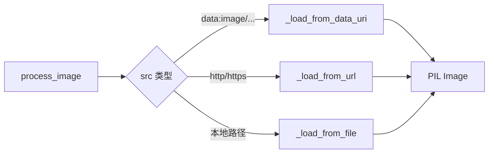
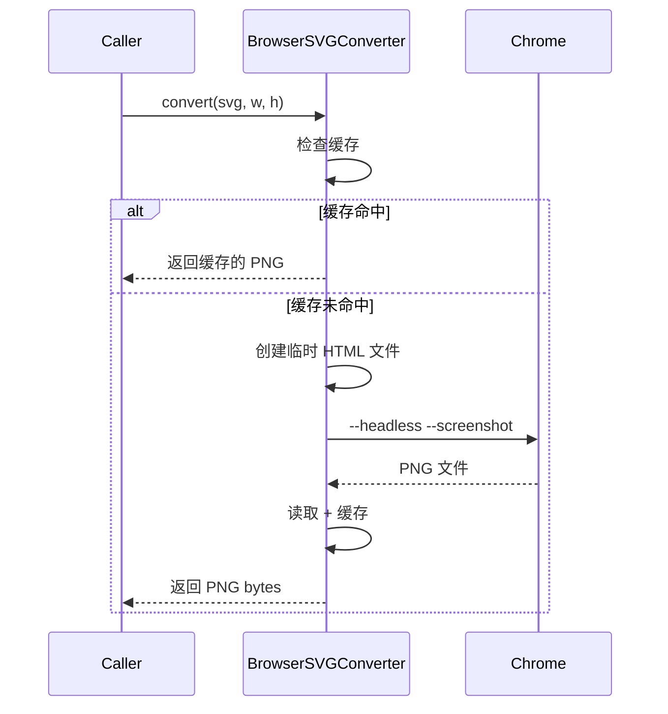
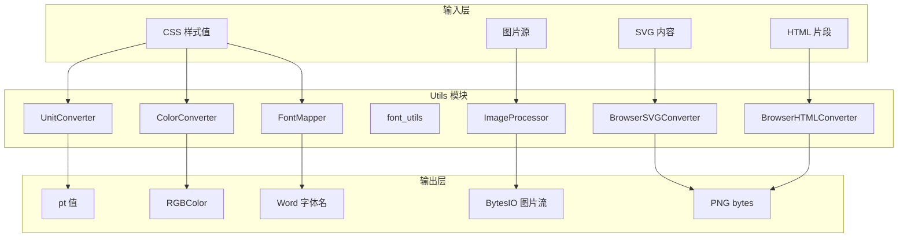

# 07. 工具函数库 (Utils Module)

> 模块路径：`src/html2word/utils/`

## 概述

Utils 模块提供 HTML 到 Word 转换所需的核心工具函数，包括单位转换、颜色处理、字体映射、图片处理和浏览器渲染等功能。

---

## 模块结构

```
utils/
├── __init__.py               # 模块导出
├── units.py                  # CSS 单位转换
├── colors.py                 # 颜色格式转换
├── fonts.py                  # 字体映射
├── font_utils.py             # 字体统一应用
├── image_utils.py            # 图片处理与尺寸计算
├── browser_svg_converter.py  # Chrome SVG 转 PNG
└── browser_html_converter.py # Chrome HTML 截图
```

---

## 核心类

### 1. UnitConverter - 单位转换器

将 CSS 单位转换为 Word 使用的 pt (point) 单位。

```python
from html2word.utils import UnitConverter

# 基础转换
UnitConverter.to_pt("12px")      # -> 9.0 pt
UnitConverter.to_pt("1in")       # -> 72.0 pt
UnitConverter.to_pt("2.54cm")    # -> 72.0 pt

# 相对单位（需要上下文）
UnitConverter.to_pt("2em", {"parent_font_size": 12})  # -> 24.0 pt
UnitConverter.to_pt("1.5rem", {"root_font_size": 16}) # -> 24.0 pt
UnitConverter.to_pt("50%", {"base_value": 200})       # -> 100.0 pt
```

#### 支持的单位

| 单位 | 描述 | 转换公式 |
|------|------|----------|
| `px` | 像素 | `px × 0.75` |
| `pt` | 磅 | 直接使用 |
| `in` | 英寸 | `in × 72` |
| `cm` | 厘米 | `cm × 28.35` |
| `mm` | 毫米 | `mm × 2.835` |
| `em` | 相对父元素 | `em × parent_font_size` |
| `rem` | 相对根元素 | `rem × root_font_size` |
| `%` | 百分比 | `base_value × %/100` |

#### 其他转换方法

```python
# 转换为 twips (python-docx 内部单位)
UnitConverter.to_twips("12px")  # -> 180 twips (1pt = 20 twips)

# 转换为 EMU (图片尺寸单位)
UnitConverter.to_emu("1in")     # -> 914400 EMU

# 解析 CSS box 值 (margin/padding)
UnitConverter.parse_box_values("10px 20px")
# -> {"top": 10, "right": 20, "bottom": 10, "left": 20}

UnitConverter.parse_box_values("10px 20px 30px 40px")
# -> {"top": 10, "right": 20, "bottom": 30, "left": 40}

# 解析边框宽度
UnitConverter.parse_border_width("thin")    # -> 1
UnitConverter.parse_border_width("medium")  # -> 1 (优化为细线)
UnitConverter.parse_border_width("thick")   # -> 5
```

---

### 2. ColorConverter - 颜色转换器

处理 CSS 颜色格式到 Word RGBColor 的转换。

```python
from html2word.utils import ColorConverter

# 解析为 RGB 元组
ColorConverter.parse_color("#FF0000")           # -> (255, 0, 0)
ColorConverter.parse_color("#F00")              # -> (255, 0, 0)
ColorConverter.parse_color("rgb(255, 0, 0)")    # -> (255, 0, 0)
ColorConverter.parse_color("rgba(255,0,0,0.5)") # -> (255, 0, 0)
ColorConverter.parse_color("red")               # -> (255, 0, 0)

# 转换为 Word RGBColor
from docx.shared import RGBColor
rgb_color = ColorConverter.to_rgb_color("#FF0000")  # -> RGBColor(255, 0, 0)

# 转换为十六进制
ColorConverter.to_hex("rgb(255, 128, 0)")  # -> "#FF8000"
```

#### 支持的颜色格式

| 格式 | 示例 |
|------|------|
| 6位十六进制 | `#FF0000` |
| 3位十六进制 | `#F00` |
| RGB | `rgb(255, 0, 0)` |
| RGBA | `rgba(255, 0, 0, 0.5)` |
| 颜色名称 | `red`, `blue`, `coral`, ... |

#### 辅助方法

```python
# 判断是否为浅色（用于对比度计算）
ColorConverter.is_light_color("#FFFFFF")  # -> True
ColorConverter.is_light_color("#000000")  # -> False

# 判断是否透明或接近白色
ColorConverter.is_transparent_or_near_white("transparent")  # -> True
ColorConverter.is_transparent_or_near_white("#FEFEFE")      # -> True
ColorConverter.is_transparent_or_near_white("#F0F0F0")      # -> False
```

#### 内置颜色名称表

```python
COLOR_NAMES = {
    # 基础颜色
    "black": (0, 0, 0),
    "white": (255, 255, 255),
    "red": (255, 0, 0),
    "green": (0, 128, 0),
    "blue": (0, 0, 255),
    # 扩展颜色
    "orange": (255, 165, 0),
    "coral": (255, 127, 80),
    "crimson": (220, 20, 60),
    # ... 共 30+ 种
}
```

---

### 3. FontMapper - 字体映射器

将 Web 字体映射到 Word 支持的字体。

```python
from html2word.utils import FontMapper

mapper = FontMapper()  # 自动加载 config/font_mapping.yaml

# 单个字体映射
mapper.map_font("Arial")      # -> "Arial"
mapper.map_font("Helvetica")  # -> "Arial" (映射)

# CSS font-family 列表
mapper.map_font("Helvetica, Arial, sans-serif")  # -> "Arial"
mapper.map_font("Unknown Font")                   # -> "Calibri" (默认)

# 添加自定义映射
mapper.add_mapping("PingFang SC", "Microsoft YaHei")

# 获取可用字体列表
mapper.get_available_fonts()  # -> ["Arial", "Calibri", ...]
```

#### 默认字体映射

| Web 字体 | Word 字体 |
|----------|----------|
| `Helvetica` | `Arial` |
| `sans-serif` | `Arial` |
| `serif` | `Times New Roman` |
| `monospace` | `Courier New` |
| `Consolas` | `Consolas` |

#### 配置文件

```yaml
# config/font_mapping.yaml
default: Calibri

# Sans-serif
Arial: Arial
Helvetica: Arial
Verdana: Verdana

# Serif
Times New Roman: Times New Roman
Georgia: Georgia

# Monospace
Courier New: Courier New
Consolas: Consolas

# 中文字体
Microsoft YaHei: Microsoft YaHei
SimSun: SimSun
```

---

### 4. font_utils - 字体统一应用

解决 Word 中混合语言字符字体不一致问题。

```python
from html2word.utils.font_utils import apply_uniform_font, get_run_font_info

# 应用统一字体到所有字符类型
run = paragraph.add_run("2024年报告")
apply_uniform_font(run, "Microsoft YaHei")
```

#### 问题背景

Word 对不同字符类型使用不同字体属性：
- `ascii`: ASCII 字符 (a-z, 0-9)
- `hAnsi`: 高位 ANSI 字符
- `eastAsia`: 东亚字符 (中文、日文等)
- `cs`: 复杂脚本字符 (阿拉伯文等)

`apply_uniform_font` 同时设置所有属性，确保混合内容字体一致：

```xml
<w:rFonts w:ascii="Microsoft YaHei"
          w:hAnsi="Microsoft YaHei"
          w:eastAsia="Microsoft YaHei"
          w:cs="Microsoft YaHei"/>
```

---

### 5. ImageProcessor - 图片处理器

处理各种来源的图片：本地文件、URL、Base64 Data URI。

```python
from html2word.utils import ImageProcessor

processor = ImageProcessor(base_path="/path/to/project")

# 处理图片（返回 BytesIO 流和尺寸）
result = processor.process_image(
    src="images/logo.png",
    max_width=800,
    max_height=600,
    transform="rotate(15deg)",
    filter_css="grayscale(50%)"
)

if result:
    stream, (width, height) = result
    # stream: io.BytesIO 对象
    # width, height: 处理后的尺寸
```

#### 图片来源类型



#### 支持的 CSS 滤镜

| 滤镜 | 示例 | 说明 |
|------|------|------|
| `grayscale` | `grayscale(100%)` | 灰度转换 |
| `brightness` | `brightness(150%)` | 亮度调整 |
| `contrast` | `contrast(120%)` | 对比度调整 |
| `blur` | `blur(3px)` | 高斯模糊 |
| `sepia` | `sepia(80%)` | 棕褐色调 |

#### 支持的 CSS 变换

| 变换 | 示例 | 说明 |
|------|------|------|
| `rotate` | `rotate(15deg)` | 旋转 |
| `scale` | `scale(1.5)` | 缩放 |

#### 显示尺寸计算

```python
# 计算 Word 文档中的显示尺寸（英寸）
width_in, height_in = processor.calculate_display_size(
    image_size=(1920, 1080),  # 原始像素尺寸
    css_width="400px",         # CSS 宽度
    css_height=None,           # 自动计算高度
    max_width=6.5              # 最大宽度 6.5 英寸
)
```

---

### 6. BrowserSVGConverter - SVG 转换器

使用 Chrome Headless 将 SVG 转换为 PNG，支持复杂图表（ECharts、D3.js 等）。

```python
from html2word.utils.browser_svg_converter import get_browser_converter

converter = get_browser_converter()  # 全局单例

# 单个转换
png_data = converter.convert(svg_content, width=400, height=300)

# 批量并行转换（性能优化）
svg_list = [
    (svg1, 400, 300),
    (svg2, 600, 400),
    (svg3, 800, 600),
]
cache = converter.convert_batch(svg_list, max_workers=4)

# 从缓存获取
png_data = converter.get_cached(svg_content, width, height)
```

#### 转换流程



#### 特性

- **缓存机制**: MD5 哈希缓存避免重复转换
- **批量并行**: `convert_batch` 使用线程池
- **超时保护**: 单个转换 15s，批量总计 120s
- **高分辨率**: 默认 2x 缩放因子（可通过 `HTML2WORD_SCREENSHOT_SCALE` 配置）
- **小尺寸处理**: <16px 的 SVG 自动扩展窗口后裁剪

#### Chrome 查找路径

```python
# Windows
"C:\\Program Files\\Google\\Chrome\\Application\\chrome.exe"
"C:\\Program Files (x86)\\Google\\Chrome\\Application\\chrome.exe"
"%LOCALAPPDATA%\\Google\\Chrome\\Application\\chrome.exe"

# Linux
"/usr/bin/google-chrome"
"/usr/bin/chromium-browser"

# macOS
"/Applications/Google Chrome.app/Contents/MacOS/Google Chrome"
```

---

### 7. BrowserHTMLConverter - HTML 截图转换器

使用 Chrome Headless 将复杂 HTML（如带背景图和定位文字的元素）转换为 PNG。

```python
from html2word.utils.browser_html_converter import get_browser_html_converter

converter = get_browser_html_converter()  # 全局单例

# 完整 HTML 文档
html_content = """<!DOCTYPE html>
<html>
<head><style>
    body { margin: 0; }
    .container {
        width: 300px;
        height: 200px;
        background-image: url('...');
        position: relative;
    }
    .text {
        position: absolute;
        top: 50%;
        left: 50%;
        transform: translate(-50%, -50%);
    }
</style></head>
<body><div class="container"><span class="text">标题</span></div></body>
</html>"""

png_data = converter.convert(html_content, width=300, height=200)
```

#### 使用场景

1. **背景图 + 叠加文字**: 无法在 Word 中直接实现的布局
2. **复杂 CSS 布局**: Grid/Flex 布局的精确渲染
3. **CSS 动画帧**: 截取特定状态

---

## 工具函数流程图



---

## 环境变量配置

| 变量名 | 默认值 | 说明 |
|--------|--------|------|
| `HTML2WORD_SCREENSHOT_SCALE` | `2` | Chrome 截图缩放因子 |

---

## 性能考虑

### SVG 批量转换优化

```python
# 在 DocumentBuilder 中预处理所有 SVG
def _preprocess_svg_nodes(self, tree):
    """批量预转换所有 SVG 节点"""
    svg_list = []
    for node in tree.find_all("svg"):
        width, height = self._calculate_svg_size(node)
        svg_content = serialize_svg_node(node)
        svg_list.append((svg_content, width, height))

    # 一次性批量转换
    converter = get_browser_converter()
    converter.convert_batch(svg_list, max_workers=4)
```

### 图片缓存策略

- **内存缓存**: 同一文档内的重复图片自动复用
- **URL 缓存**: 相同 URL 只下载一次
- **Base64 解码缓存**: 相同 Data URI 只解码一次

---

## 错误处理

所有工具类都遵循**优雅降级**原则：

```python
# 颜色解析失败 -> 返回 None
ColorConverter.parse_color("invalid")  # -> None

# 单位解析失败 -> 返回 0
UnitConverter.to_pt("")  # -> 0.0

# 图片处理失败 -> 返回 None
processor.process_image("nonexistent.png")  # -> None

# SVG 转换失败 -> 返回 None（使用 PIL fallback）
converter.convert(invalid_svg, 100, 100)  # -> None
```

---

## 常见问题

### Q: 如何处理中英文混排字体问题？

使用 `apply_uniform_font` 确保所有字符类型使用相同字体：

```python
run = paragraph.add_run("Hello 世界 2024")
apply_uniform_font(run, "Microsoft YaHei")
```


### Q: 如何自定义字体映射？

方式一：修改配置文件
```yaml
# config/font_mapping.yaml
"Source Han Sans": "Microsoft YaHei"
```

方式二：运行时添加
```python
mapper = FontMapper()
mapper.add_mapping("Source Han Sans", "Microsoft YaHei")
```

### Q: 图片超过页面宽度怎么办？

`ImageProcessor.calculate_display_size` 自动限制最大宽度为 6.5 英寸：

```python
# 自动缩放
width, height = processor.calculate_display_size(
    image_size=(2000, 1000),  # 原始尺寸很大
    max_width=6.5             # 限制最大宽度
)
# width <= 6.5 英寸，height 按比例缩放
```

---

## 总结

Utils 模块提供了 HTML 到 Word 转换所需的核心基础设施：

| 工具类 | 职责 |
|--------|------|
| `UnitConverter` | CSS 单位 → Word pt |
| `ColorConverter` | CSS 颜色 → RGBColor |
| `FontMapper` | Web 字体 → Word 字体 |
| `font_utils` | 多语言字体统一 |
| `ImageProcessor` | 图片加载/处理/尺寸计算 |
| `BrowserSVGConverter` | SVG → PNG (Chrome) |
| `BrowserHTMLConverter` | HTML → PNG (Chrome) |

这些工具类被 `word_builder` 模块的各个 Builder 广泛使用，是整个转换系统的基础支撑层。

---

**下一章**：[08. CLI 与 API 参考](08_CLI_API.md)
