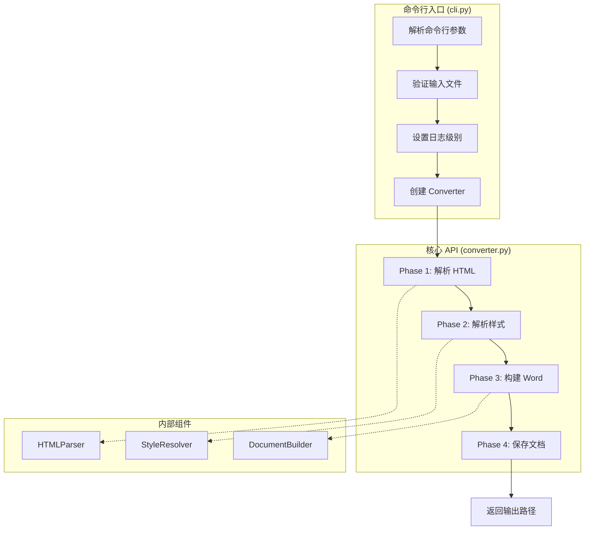

# 08. CLI 与 API 参考

> 本文档详细介绍 HTML2Word 的命令行接口 (CLI) 和编程 API 使用方法。

---

## 模块概览

| 文件 | 功能 | 行数 |
|------|------|------|
| `cli.py` | 命令行入口 | 123 |
| `converter.py` | 核心转换 API | 112 |

---

## 1. 安装

### 从 PyPI 安装

```bash
pip install html2word
```

### 从源码安装

```bash
git clone https://github.com/Xupai2022/html2word.git
cd html2word
pip install -e .
```

### 开发依赖

```bash
pip install -e ".[dev]"
```

---

## 2. 命令行接口 (CLI)

### 2.1 基本语法

```bash
html2word <input.html> -o <output.docx> [OPTIONS]
```

### 2.2 参数说明

| 参数 | 类型 | 必需 | 默认值 | 说明 |
|------|------|------|--------|------|
| `input` | 位置参数 | ✅ | - | 输入 HTML 文件路径 |
| `-o, --output` | 选项 | ✅ | - | 输出 Word 文件路径 |
| `--base-path` | 选项 | ❌ | 输入文件目录 | 相对资源路径基准目录 |
| `--log-level` | 选项 | ❌ | `INFO` | 日志级别 |
| `--version` | 标志 | ❌ | - | 显示版本号 |

### 2.3 日志级别

| 级别 | 说明 |
|------|------|
| `DEBUG` | 详细调试信息，包含每个节点处理过程 |
| `INFO` | 标准信息，显示转换阶段和统计 |
| `WARNING` | 警告信息，如字体不支持、图片加载失败 |
| `ERROR` | 错误信息，仅显示致命错误 |

### 2.4 使用示例

```bash
# 基本转换
html2word report.html -o report.docx

# 启用调试日志
html2word report.html -o report.docx --log-level DEBUG

# 指定资源路径
html2word pages/index.html -o output.docx --base-path /var/www/static

# 查看版本
html2word --version
# 输出: html2word 0.1.0
```

### 2.5 退出码

| 退出码 | 含义 |
|--------|------|
| `0` | 转换成功 |
| `1` | 转换失败（文件不存在、解析错误等） |

---

## 3. Python API

### 3.1 核心类：HTML2WordConverter

```python
from html2word.converter import HTML2WordConverter
```

#### 构造函数

```python
HTML2WordConverter(base_path: Optional[str] = None)
```

| 参数 | 类型 | 默认值 | 说明 |
|------|------|--------|------|
| `base_path` | `str` | `os.getcwd()` | 相对路径基准目录 |

#### 主要方法

| 方法 | 返回值 | 说明 |
|------|--------|------|
| `convert(html_input, output_path, input_type)` | `str` | 通用转换方法 |
| `convert_file(html_file, output_file)` | `str` | 从文件转换 |
| `convert_string(html_string, output_file)` | `str` | 从字符串转换 |

### 3.2 API 详细说明

#### convert() 方法

```python
def convert(
    self,
    html_input: str,
    output_path: str,
    input_type: str = "file"
) -> str
```

**参数：**
- `html_input`: HTML 文件路径或 HTML 字符串
- `output_path`: 输出 `.docx` 文件路径
- `input_type`: 输入类型，`"file"` 或 `"string"`

**返回：** 输出文件的绝对路径

**异常：**
- `FileNotFoundError`: 输入文件不存在
- `ValueError`: HTML 解析失败
- `Exception`: 其他转换错误

#### convert_file() 方法

```python
def convert_file(self, html_file: str, output_file: str) -> str
```

`convert()` 的便捷包装，固定 `input_type="file"`。

#### convert_string() 方法

```python
def convert_string(self, html_string: str, output_file: str) -> str
```

`convert()` 的便捷包装，固定 `input_type="string"`。

### 3.3 使用示例

#### 基本用法

```python
from html2word.converter import HTML2WordConverter

# 创建转换器
converter = HTML2WordConverter()

# 从文件转换
converter.convert_file("input.html", "output.docx")

# 从字符串转换
html = """
<html>
<head>
    <style>
        h1 { color: blue; }
        p { font-size: 14pt; }
    </style>
</head>
<body>
    <h1>标题</h1>
    <p>正文内容</p>
</body>
</html>
"""
converter.convert_string(html, "output.docx")
```

#### 指定资源路径

```python
# 图片、CSS 等相对路径将基于此目录解析
converter = HTML2WordConverter(base_path="/var/www/static")
converter.convert_file("pages/report.html", "report.docx")
```

#### 批量转换

```python
import os
from html2word.converter import HTML2WordConverter

converter = HTML2WordConverter()

html_files = ["report1.html", "report2.html", "report3.html"]
for html_file in html_files:
    output_file = html_file.replace(".html", ".docx")
    try:
        converter.convert_file(html_file, output_file)
        print(f"✅ {html_file} -> {output_file}")
    except Exception as e:
        print(f"❌ {html_file}: {e}")
```

#### 配合 logging 使用

```python
import logging
from html2word.converter import HTML2WordConverter

# 配置日志
logging.basicConfig(
    level=logging.DEBUG,
    format='%(asctime)s - %(name)s - %(levelname)s - %(message)s'
)

converter = HTML2WordConverter()
converter.convert_file("input.html", "output.docx")
```

日志输出示例：
```
2024-01-15 10:30:00 - html2word.converter - INFO - Starting HTML to Word conversion
2024-01-15 10:30:00 - html2word.converter - INFO - Input: input.html
2024-01-15 10:30:00 - html2word.converter - INFO - Output: output.docx
2024-01-15 10:30:00 - html2word.converter - INFO - Phase 1: Parsing HTML
2024-01-15 10:30:00 - html2word.converter - INFO - Parsed 150 nodes (85 elements)
2024-01-15 10:30:00 - html2word.converter - INFO - Phase 2: Resolving styles
2024-01-15 10:30:00 - html2word.converter - INFO - Phase 3: Building Word document
2024-01-15 10:30:01 - html2word.converter - INFO - Phase 4: Saving document
2024-01-15 10:30:01 - html2word.converter - INFO - Conversion complete: output.docx
```

---

## 4. 转换流程



---

## 5. 模块级 API

除了 `HTML2WordConverter` 类，还可以直接使用各模块的低级 API：

### 5.1 解析器 API

```python
from html2word.parser.html_parser import HTMLParser

parser = HTMLParser(base_path=".")
tree = parser.parse_file("input.html")
# 或
tree = parser.parse("<html>...</html>")

# 获取统计信息
stats = tree.get_stats()
print(f"总节点数: {stats['total_nodes']}")
print(f"元素节点: {stats['element_nodes']}")
```

### 5.2 样式解析器 API

```python
from html2word.style.style_resolver import StyleResolver

resolver = StyleResolver()
resolver.resolve_styles(tree)  # 修改 tree 节点的 computed_style
```

### 5.3 文档构建器 API

```python
from html2word.word_builder.document_builder import DocumentBuilder

builder = DocumentBuilder(base_path=".")
document = builder.build(tree)  # 返回 python-docx Document 对象
document.save("output.docx")
```

### 5.4 工具类 API

```python
from html2word.utils import UnitConverter, ColorConverter, FontMapper, ImageProcessor

# 单位转换
pt = UnitConverter.to_pt("16px")  # 12.0

# 颜色转换
rgb = ColorConverter.to_rgb_color("#ff0000")

# 字体映射
mapper = FontMapper()
word_font = mapper.map_font("Arial")

# 图片处理
processor = ImageProcessor(base_path=".")
stream, size = processor.process_image("logo.png")
```

---

## 6. 环境变量

HTML2Word 支持以下环境变量进行运行时配置：

| 环境变量 | 默认值 | 说明 | 适用范围 |
|----------|--------|------|----------|
| `HTML2WORD_SCREENSHOT_SCALE` | `2` | Chrome 截图缩放因子 (1-3，数值越大清晰度越高) | SVG/HTML 截图 |
| `HTML2WORD_PARALLEL` | `true` | 是否启用并行处理 (`true`/`false`) | 样式表解析 |
| `HTML2WORD_MONITOR` | `true` | 是否启用性能监控 (`true`/`false`) | 样式表解析 |
| `HTML2WORD_WORKERS` | `4` | 并行处理的 worker 数量 | 样式表解析 |

### 环境变量详解

#### HTML2WORD_SCREENSHOT_SCALE
- **作用位置**: `browser_svg_converter.py`, `browser_html_converter.py`
- **说明**: 控制 Chrome 无头浏览器渲染 SVG/HTML 片段时的分辨率倍数
- **取值**: 1-3 之间的整数
  - `1`: 标准分辨率（较快）
  - `2`: 2倍分辨率（默认，平衡清晰度与性能）
  - `3`: 3倍分辨率（最清晰，但耗时更长）

#### HTML2WORD_PARALLEL
- **作用位置**: `stylesheet_manager_optimized.py`
- **说明**: 是否启用样式表的并行解析（对于大量 `<style>` 标签或外部 CSS 有性能提升）
- **取值**: `true` 或 `false`

#### HTML2WORD_MONITOR
- **作用位置**: `stylesheet_manager_optimized.py`
- **说明**: 是否启用性能监控（会输出样式解析耗时统计）
- **取值**: `true` 或 `false`

#### HTML2WORD_WORKERS
- **作用位置**: `stylesheet_manager_optimized.py`
- **说明**: 并行处理时的 worker 线程/进程数量
- **取值**: 正整数（建议 2-8，具体根据 CPU 核心数调整）

### 使用示例

```bash
# Linux/Mac - 高清晰度截图 + 禁用并行
export HTML2WORD_SCREENSHOT_SCALE=3
export HTML2WORD_PARALLEL=false
html2word input.html -o output.docx

# Windows PowerShell - 自定义 worker 数量 + 启用监控
$env:HTML2WORD_WORKERS="8"
$env:HTML2WORD_MONITOR="true"
html2word input.html -o output.docx

# Windows CMD - 标准分辨率 + 禁用监控
set HTML2WORD_SCREENSHOT_SCALE=1
set HTML2WORD_MONITOR=false
html2word input.html -o output.docx

# 一次性设置多个环境变量（Linux/Mac）
HTML2WORD_SCREENSHOT_SCALE=3 HTML2WORD_PARALLEL=true HTML2WORD_WORKERS=6 html2word input.html -o output.docx
```

### 性能调优建议

| 场景 | 推荐配置 |
|------|----------|
| 快速预览（不在意清晰度） | `SCREENSHOT_SCALE=1`, `PARALLEL=true` |
| 生产环境（高质量输出） | `SCREENSHOT_SCALE=3`, `WORKERS=4-8` |
| 低配机器（减少内存占用） | `PARALLEL=false`, `SCREENSHOT_SCALE=1` |
| 调试样式问题 | `MONITOR=true` 查看解析耗时 |

---

## 7. 错误处理

### 7.1 常见异常

| 异常类型 | 触发场景 | 处理建议 |
|----------|----------|----------|
| `FileNotFoundError` | 输入文件不存在 | 检查路径拼写 |
| `ValueError` | HTML 解析失败 | 检查 HTML 语法 |
| `PermissionError` | 输出文件被占用 | 关闭 Word 程序 |
| `IOError` | 磁盘空间不足 | 清理磁盘 |

### 7.2 异常处理示例

```python
from html2word.converter import HTML2WordConverter

converter = HTML2WordConverter()

try:
    converter.convert_file("input.html", "output.docx")
except FileNotFoundError:
    print("输入文件不存在")
except PermissionError:
    print("无法写入输出文件，请检查文件是否被占用")
except Exception as e:
    print(f"转换失败: {e}")
```

---

## 8. 与 python-docx 集成

转换完成后可使用 `python-docx` 进行后处理：

```python
from html2word.converter import HTML2WordConverter
from docx import Document

# 转换
converter = HTML2WordConverter()
converter.convert_file("input.html", "output.docx")

# 后处理
doc = Document("output.docx")

# 添加页眉
section = doc.sections[0]
header = section.header
header.paragraphs[0].text = "机密文档"

# 添加页脚
footer = section.footer
footer.paragraphs[0].text = "第 X 页"

# 保存
doc.save("output_with_header.docx")
```

---

## 9. 性能优化

### 9.1 大文件处理

```python
import logging
from html2word.converter import HTML2WordConverter

# 减少日志输出
logging.getLogger("html2word").setLevel(logging.WARNING)

converter = HTML2WordConverter()
converter.convert_file("large_report.html", "output.docx")
```

### 9.2 批量处理优化

```python
from html2word.converter import HTML2WordConverter
from concurrent.futures import ThreadPoolExecutor

def convert_single(args):
    html_file, output_file, base_path = args
    converter = HTML2WordConverter(base_path=base_path)
    return converter.convert_file(html_file, output_file)

# 并行转换多个文件
files = [
    ("report1.html", "report1.docx", "."),
    ("report2.html", "report2.docx", "."),
    ("report3.html", "report3.docx", "."),
]

with ThreadPoolExecutor(max_workers=4) as executor:
    results = list(executor.map(convert_single, files))
```

---

## 10. 项目配置

### pyproject.toml 入口点

```toml
[project.scripts]
html2word = "html2word.cli:main"
```

### 依赖项

| 依赖 | 版本 | 用途 |
|------|------|------|
| beautifulsoup4 | >=4.12.0 | HTML 解析 |
| python-docx | >=1.1.0 | Word 文档生成 |
| lxml | >=5.0.0 | XML 处理 |
| tinycss2 | >=1.2.0 | CSS 解析 |
| Pillow | >=10.0.0 | 图片处理 |
| requests | >=2.31.0 | HTTP 请求 |
| PyYAML | >=6.0.0 | 配置文件解析 |

---

## FAQ

### Q: 如何只安装核心依赖？

```bash
pip install html2word
```

### Q: 如何安装开发依赖？

```bash
pip install html2word[dev]
# 或从源码
pip install -e ".[dev]"
```

### Q: 如何以模块方式运行？

```bash
python -m html2word input.html -o output.docx
```

### Q: 转换速度慢怎么办？

1. 减少日志级别：`--log-level WARNING`
2. 确保图片资源可访问（避免超时）
3. 对于大量 SVG，启用并行处理

### Q: 如何获取转换统计？

```python
import logging
logging.basicConfig(level=logging.INFO)

# 转换时会输出统计信息
# INFO - Parsed 150 nodes (85 elements)
```

---

## 相关文档

- [01. 项目介绍](01_Introduction.md)
- [02. 整体架构](02_Architecture.md)
- [09. 配置系统](09_Configuration.md)
